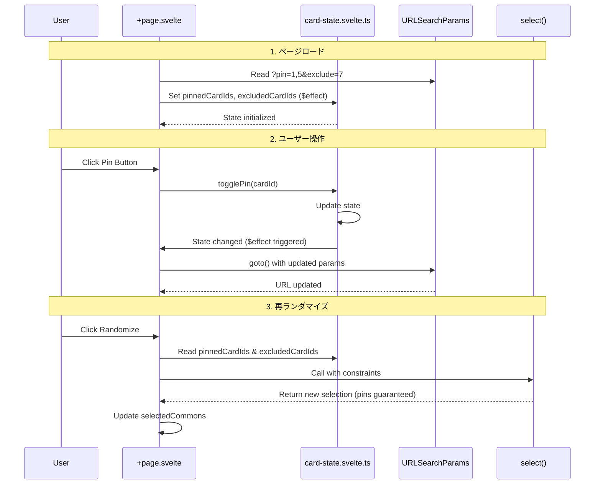

# カードのピン留めと除外機能

## 背景

Heart of Crownランダマイザーにおいて、ユーザーが特定のカードを必ず含めたい（ピン）、または特定のカードを除外したい（除外）というニーズがある。

## 機能の Goal

- 3状態管理: カードごとに3つの状態（通常、ピン、除外）を管理可能にする
- 直感的操作: ボタンクリック一つで状態をトグル変更できる
- URL共有: ピン/除外状態をURL経由で共有・保存可能にする（ブックマーク、SNS共有など）
- 状態維持: 再ランダマイズ時にピン/除外設定を維持する
- localStorage削除: 既存のlocalStorageベースの除外機能を削除し、URL-firstアーキテクチャに統一
- アクセシビリティ: キーボード操作、視覚的フィードバック（アイコン、色、フォーカスインジケーター）を提供

## 機能の Non-Goal

- ARIA属性の完全実装（aria-labelやaria-liveはオプション要件として将来検討）
- URL長の動的最適化（初期実装では約2000文字のブラウザ制限内に収まることのみ確認）
- 既存の除外設定のデータ移行機能（localStorage廃止に伴い設定はリセットされる）
- ピン/除外設定のプリセット機能（例: 「初心者向け」「上級者向け」プリセット）

## 採用した方針

### アーキテクチャ: 新規コンポーネント分離（Option B）

実装アプローチ:

1. card-state.svelte.ts (`stores/`): ピン/除外状態の集中管理（関数群: `getCardState`, `togglePin`, `toggleExclude`, `getPinnedCards`, `getExcludedCards`）
1. Card.svelte: アクションボタン付きカード表示、視覚的フィードバック
1. +page.svelte: URL同期、ランダマイズオーケストレーション、制約適用

ドメイン境界:

- UI Layer (`site`): Card.svelte（アクションボタン付きカード表示）
- State Layer (`site`): stores/card-state.svelte.ts（ピン/除外状態管理、関数群としてエクスポート）
- Logic Layer (`randomizer`): 既存`select()`関数を再利用（新規実装不要）

状態管理:

- Svelte 5 runes (`$state`, `$effect`, `$derived`) を使用したリアクティブ状態管理
- URL Query Parametersを唯一の情報源（Single Source of Truth）
- カンマ区切り形式で複数IDをエンコード（例: `?pin=1,5,12&exclude=7,9`）
- SSR対策: モジュールスコープの状態は`+page.svelte`の`$effect`で初期化し、リクエスト間の状態リークを防ぐ

ビジネスルール:

- カードは同時にピンと除外の両方にはなれない（相互排他）
- ピンカード数は選択枠（targetCount）を超えてはならない
- 除外後の残りカード数は選択枠以上でなければならない
- 再ランダマイズ時、ピンカードは必ず結果に含まれる
- 除外カードは絶対に結果に含まれない

### 採用した Pros

1. 保守性向上: 単一責任原則（SRP）に準拠
   - 各モジュールが単一の責任を持つ（card-state.svelte.ts: 状態管理、Card.svelte: UI表示）
   - 変更が局所化され、影響範囲が明確

1. テスト性向上: モジュール単位でテスト可能
   - card-state.svelte.ts: 純粋な状態ロジックとしてunit test
   - Card.svelte: UI統合としてintegration test
   - +page.svelte: フルフローとしてE2E test

1. 再利用性: 将来の拡張が容易
   - card-state.svelte.tsの関数群は他の機能（例: お気に入り管理）からも参照可能

1. プロジェクト方針準拠:
   - URL-based state sharing（設定の共有性を重視）
   - Separation of Concerns（card/randomizer/siteのパッケージ境界を維持）
   - TypeScript strict mode（型安全性、`any`の使用禁止）

1. 既存パターンとの一貫性:
   - URL同期: 既存の`selectedCommons`と同じ`$effect`パターンを踏襲
   - カンマ区切り形式: 既存の`card` parameterと一貫した可読性の高いURL
   - 制約API: 既存の`select()`関数を再利用（新規ロジック不要）

### 採用した Cons

1. 初期実装コストが高い:
   - 新規モジュール2つ（stores/card-state.svelte.ts, Card.svelte）を作成
   - 既存コンポーネントの変更（+page.svelte）
   - 約200行のlocalStorageコード削除 + 新規実装

1. モジュール間の依存関係:
   - Card.svelte → stores/card-state.svelte.ts の依存
   - +page.svelte → stores/card-state.svelte.ts, select() の依存
   - 依存関係の変更時に複数ファイルの修正が必要

1. 学習コスト:
   - Svelte 5 runesの`.svelte.ts`パターン（stores/card-state.svelte.ts）に不慣れな開発者向け
   - URL同期の双方向バインディング（URL ↔ State）の理解が必要

## 他の検討案

### Option A: 既存コンポーネントへの直接追加

アプローチ:

- `+page.svelte`に状態管理とUIを直接追加
- 新規コンポーネントを作成せず、既存コードを拡張

Pros:

- 実装コストが低い（1ファイルのみ変更）
- コンポーネント間の依存関係なし
- 学習コストが低い（既存パターンの延長）

Cons:

- `+page.svelte`が肥大化（単一責任原則違反）
- テストが困難（フルE2Eテストのみ、unit/integration test不可）
- 再利用性なし（他のページで同じ機能を使えない）
- 保守性が低い（状態管理とUIが混在し、変更の影響範囲が不明確）

不採用理由:

- プロジェクトが重視する「関心の分離」（card/randomizer/siteのパッケージ境界維持）に反する
- 長期的な保守性とテスト性を優先（短期的な実装コスト削減よりも重要）
- 既存コードベースの品質基準（型安全性、テスタビリティ）を維持

## 技術詳細

### URL形式

```text
例: https://example.com/?pin=1,5,12&exclude=7,9&seed=abc123

- pin: ピン留めするカードIDのカンマ区切りリスト
- exclude: 除外するカードIDのカンマ区切りリスト
- 既存のseedパラメータと共存可能
```

### 状態フロー



### エラー処理

| エラー | 条件 | メッセージ例 |
|--------|------|--------------|
| ピン数超過 | ピン数 > 選択枠 | "ピンされたカードが多すぎます（12/10）。ピンを2枚解除してください。" |
| 除外不足 | 利用可能カード < 選択枠 | "除外により選択可能なカードが不足しています（8/10）。除外を2枚解除してください。" |
| 無効なID | URL内の非数値ID | 無視（エラー表示なし、コンソールwarning） |
