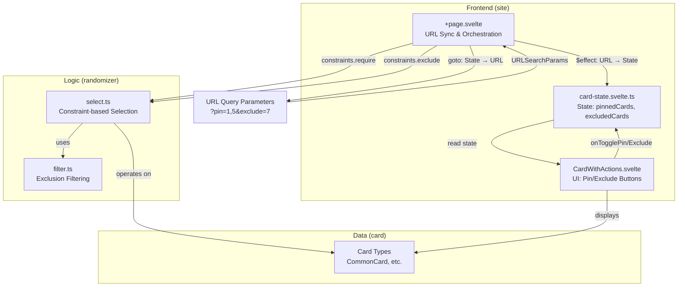
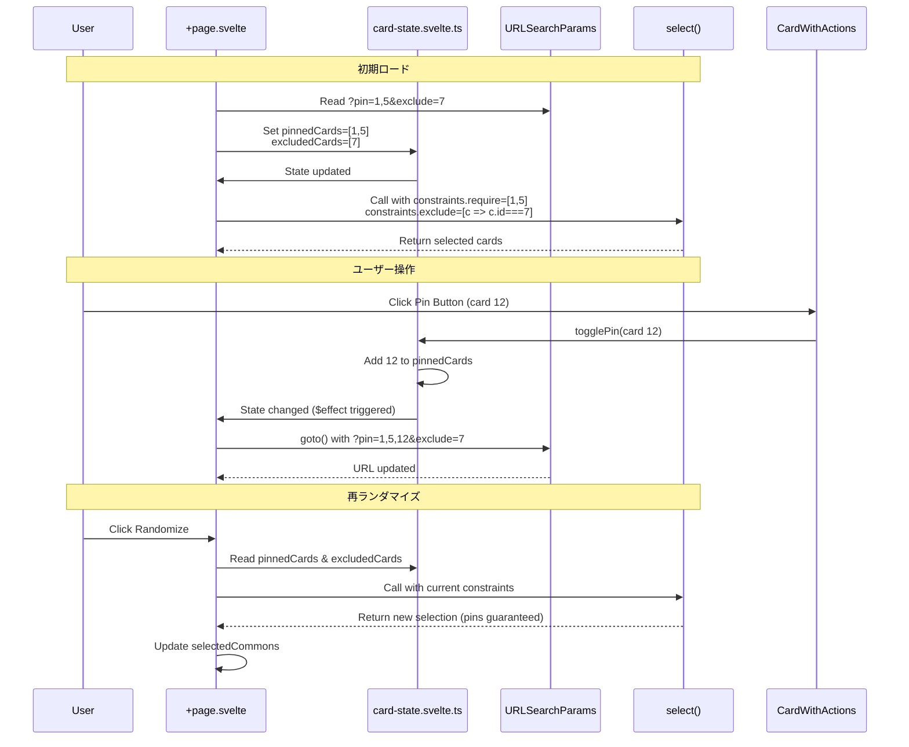
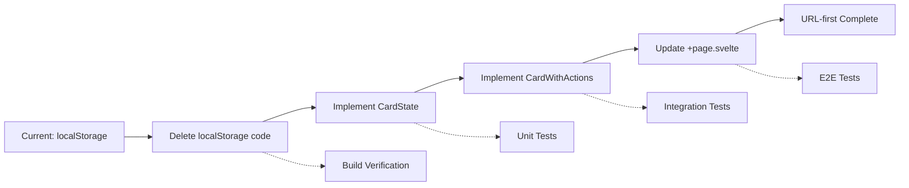

# Design Document: Card Pin/Exclude Feature

---
**目的**: 異なる実装者間で実装の一貫性を確保し、解釈のズレを防ぐための十分な詳細を提供する

**アプローチ**:
- 実装判断に直接影響する必須セクションを含む
- 実装エラーを防ぐために重要でない限り、オプションセクションは省略
- 詳細レベルを機能の複雑さに合わせる
- 長い文章よりも図表を使用
---

## Overview

**目的**: この機能は、ランダマイザーユーザーに対して、カードのピン留め（必須化）と除外機能を提供し、ゲームセットアップの柔軟性を向上させます。

**ユーザー**: Heart of Crownプレイヤーは、特定のカードを必ず含めたい場合（ピン）、または特定のカードを除外したい場合（除外）に、この機能を使用します。すべての状態はURL経由で共有可能であり、他のプレイヤーとの共有やブックマークが可能です。

**影響**: 現在のlocalStorageベースのカード除外機能（約200行）を削除し、URL-firstアーキテクチャに統一します。これにより、すべてのカード状態（選択結果、ピン、除外）がURLを唯一の情報源（Single Source of Truth）として管理されます。

### Goals

- カードごとに3つの状態（通常、ピン、除外）を管理可能にする
- 直感的なUI操作（ボタンクリック）でピン/除外状態を変更できる
- ピン/除外状態をURL経由で共有・保存可能にする
- 再ランダマイズ時にピン/除外設定を維持する
- 既存のlocalStorageベースの除外機能を完全に削除する
- アクセシビリティ（キーボード操作、視覚的フィードバック）を考慮する

### Non-Goals

- ARIA属性の完全実装（Requirement 6.4, 6.5はMAY）
- URL長の動的最適化（初期実装では制限チェックなし）
- 既存の除外設定のデータ移行（URL-firstへの完全移行）
- ピン/除外設定のプリセット機能（将来検討）

## Architecture

### Existing Architecture Analysis

**現在のアーキテクチャパターン**:
- **パッケージ構成**: Monorepo（card/randomizer/site）
- **状態管理**: Svelte 5 runes (`$state`, `$effect`, `$derived`)
- **URL同期**: `+page.svelte` L34-47で既存実装（`selectedCommons`）
- **ランダム選択**: `randomizer/select.ts`の`select()`関数（制約サポート済み）

**既存ドメイン境界**:
- `card`: 純粋なデータ + 型定義（ロジックなし）
- `randomizer`: 純粋関数（DOM/状態なし）
- `site`: すべてのUI状態、エフェクト、レンダリング

**統合ポイント**:
- `+page.svelte`: 既存のURL同期パターン（L34-47）
- `select()`: 制約API (`constraints.require`, `constraints.exclude`)
- URL: カンマ区切り形式（`card` parameterと一貫）

**技術的負債**:
- **削除対象**: localStorage依存の除外機能（~200行）
  - `excludedCommons` state (L16)
  - localStorage読み込み `$effect` (L19-32)
  - `removeFromExcludedCommons()` (L222-225)
  - `clearExcludedCommons()` (L256-259)
  - 除外カードリストUI (L320-351)

### Architecture Pattern & Boundary Map

**選択パターン**: Option B（新規コンポーネント分離）

**理由**:
- 保守性向上（SRP: Single Responsibility Principle）
- テスト性向上（コンポーネント単位テスト）
- 再利用性（将来の拡張が容易）
- `structure.md`の「Separation of Concerns」に準拠

**ドメイン/機能境界**:
- **UI Layer** (`site`): CardWithActions.svelte（アクションボタン付きカード表示）
- **State Layer** (`site`): card-state.svelte.ts（ピン/除外状態管理）
- **Logic Layer** (`randomizer`): 既存`select()`関数を再利用（新規実装不要）



**新規コンポーネントの理由**:
- **CardState** (`.svelte.ts`): ピン/除外状態の集中管理、URL同期ロジックの分離
- **CardWithActions**: アクションボタン付きカード表示、視覚的フィードバック

**既存パターンの保持**:
- URL同期: 既存の`selectedCommons`と同じ`$effect`パターン
- カンマ区切り形式: 既存の`card` parameterと一貫
- 制約API: 既存の`select()`関数を再利用

**ステアリング準拠**:
- `product.md`: URL-based state sharing
- `structure.md`: Separation of Concerns (card/randomizer/site)
- `tech.md`: TypeScript strict mode, no `any` usage

### Technology Stack

| Layer | Choice / Version | Role in Feature | Notes |
|-------|------------------|-----------------|-------|
| Frontend / UI | Svelte 5 runes (`.svelte.ts`) | リアクティブ状態管理 | モジュールスコープ、SSR考慮が必要 |
| Frontend / UI | SvelteKit 2.x | URL同期、ページルーティング | 既存パターンを再利用 |
| Frontend / Styling | Tailwind CSS 4.x | ボタンスタイル、視覚的フィードバック | 既存クラスを活用 |
| Data / Storage | URL Query Parameters | ピン/除外状態の永続化 | Single Source of Truth |
| Logic | `randomizer/select.ts` | 制約ベースのカード選択 | 既存API再利用 |
| Runtime | TypeScript 5.9+ (strict mode) | 型安全性 | `any`の使用禁止 |

**技術選定の根拠**:
- **Svelte 5 runes**: パフォーマンス向上、型安全性、モダンなAPI（`research.md`参照）
- **URL Query Parameters**: 既存パターンとの一貫性、共有性、シンプルさ（`research.md`参照）
- **カンマ区切り形式**: 可読性、デバッグの容易さ、既存コードとの一貫性（`research.md`参照）

## System Flows

### URL Sync Flow（URL同期フロー）



**フロー判断**:
- **URL → State**: `$effect`で自動同期（既存パターン）
- **State → URL**: `goto()`で手動同期（既存パターン）
- **Constraint適用**: `select()`呼び出し時に`constraints`を渡す

## Requirements Traceability

| Requirement | Summary | Components | Interfaces | Flows |
|-------------|---------|------------|------------|-------|
| 1.1 | 3つの状態管理 | CardState | `CardStateType` | - |
| 1.2 | ピン状態のカードを必須扱い | CardState, select() | `constraints.require` | URL Sync |
| 1.3 | 除外状態のカードを選択除外 | CardState, select() | `constraints.exclude` | URL Sync |
| 1.4 | 状態クリア | CardState | `togglePin()`, `toggleExclude()` | - |
| 1.5 | URL経由で状態共有 | +page.svelte, CardState | URLSearchParams | URL Sync |
| 2.1 | ピン/除外ボタン表示 | CardWithActions | `CardWithActionsProps` | - |
| 2.2 | ピンボタンクリック処理 | CardWithActions, CardState | `onTogglePin()` | - |
| 2.3 | 除外ボタンクリック処理 | CardWithActions, CardState | `onToggleExclude()` | - |
| 2.4 | ピン状態の視覚的フィードバック | CardWithActions | Tailwind classes | - |
| 2.5 | 除外状態の視覚的フィードバック | CardWithActions | Tailwind classes | - |
| 2.6 | ピンカードの特定可能スタイル | CardWithActions | Tailwind classes | - |
| 2.7 | 除外カードの特定可能スタイル | CardWithActions | Tailwind classes | - |
| 3.1 | ピン状態解除（トグル） | CardWithActions, CardState | `togglePin()` | - |
| 3.2 | 除外状態解除（トグル） | CardWithActions, CardState | `toggleExclude()` | - |
| 3.3 | 通常スタイル復元 | CardWithActions | Tailwind classes | - |
| 3.4 | トグル動作実装 | CardState | `togglePin()`, `toggleExclude()` | - |
| 4.1 | 再ランダマイズ時のピン維持 | +page.svelte, select() | `constraints.require` | URL Sync |
| 4.2 | 再ランダマイズ時の除外維持 | +page.svelte, select() | `constraints.exclude` | URL Sync |
| 4.3 | 再ランダマイズ結果への状態反映 | +page.svelte | - | URL Sync |
| 4.4 | ピン数超過時のエラー | +page.svelte | Error message | - |
| 4.5 | 除外不足時のエラー | +page.svelte | Error message | - |
| 5.1 | 状態変更時のURL更新 | +page.svelte, CardState | `goto()` | URL Sync |
| 5.2 | URLからの状態復元 | +page.svelte, CardState | URLSearchParams | URL Sync |
| 5.3 | 既存URL管理との統合 | +page.svelte | - | URL Sync |
| 5.4 | URL長の最適化（SHOULD） | - | カンマ区切り形式 | - |
| 6.1 | キーボード操作 | CardWithActions | `<button>` element | - |
| 6.2 | フォーカスインジケーター | CardWithActions | Tailwind focus: classes | - |
| 6.3 | カラー以外の視覚的区別 | CardWithActions | アイコン | - |
| 6.4 | ARIAラベル（MAY） | - | - | - |
| 6.5 | スクリーンリーダー通知（MAY） | - | - | - |
| 7.1 | localStorage除外機能削除 | +page.svelte | - | - |
| 7.2 | 除外リスト表示削除 | +page.svelte | - | - |
| 7.3 | localStorage関連コード削除 | +page.svelte | - | - |
| 7.4 | 移行通知表示（SHOULD） | - | - | - |
| 7.5 | URL経由での全状態管理 | +page.svelte, CardState | - | URL Sync |

## Components and Interfaces

### Component Summary

| Component | Domain/Layer | Intent | Req Coverage | Key Dependencies (P0) | Contracts |
|-----------|--------------|--------|--------------|----------------------|-----------|
| CardState | site/stores | ピン/除外状態の管理 | 1.1-1.5, 3.4, 5.1-5.2 | - | State |
| CardWithActions | site/lib | アクションボタン付きカード表示 | 2.1-2.7, 3.1-3.3, 6.1-6.3 | CardState (P0) | Props, Events |
| +page.svelte | site/routes | URL同期とオーケストレーション | 4.1-4.5, 5.3, 7.1-7.3, 7.5 | CardState (P0), select() (P0) | - |

### Site / State Layer

#### CardState

| Field | Detail |
|-------|--------|
| Intent | ピン/除外カードIDをリアクティブ状態として管理し、トグル操作を提供 |
| Requirements | 1.1, 1.2, 1.3, 1.4, 1.5, 3.4, 5.1, 5.2 |
| Owner / Reviewers | - |

**Responsibilities & Constraints**
- ピン状態のカードIDセットを管理（`pinnedCardIds: Set<number>`）
- 除外状態のカードIDセットを管理（`excludedCardIds: Set<number>`）
- トグル操作を提供（`togglePin()`, `toggleExclude()`）
- 状態は`.svelte.ts`モジュールスコープで定義（SSR考慮）
- 初期化は`+page.svelte`の`$effect`で実施（URLから復元）

**Dependencies**
- Inbound: +page.svelte — URL同期、初期化 (P0)
- Inbound: CardWithActions — トグル操作 (P0)
- Outbound: なし
- External: なし

**Contracts**: State [x]

##### State Management

**State Model**:
```typescript
// packages/site/src/lib/stores/card-state.svelte.ts
import { type CommonCard } from "@omochice/heart-of-crown-randomizer-card";

/**
 * Card state type definitions
 */
export type CardStateType = "normal" | "pinned" | "excluded";

/**
 * Internal state: pinned and excluded card IDs
 * WARNING: Module-scoped state can persist across SSR requests.
 * Initialize from URL in +page.svelte $effect to avoid stale data.
 */
export let pinnedCardIds = $state<Set<number>>(new Set());
export let excludedCardIds = $state<Set<number>>(new Set());

/**
 * Derived state: get card state by ID
 */
export function getCardState(cardId: number): CardStateType {
  if (pinnedCardIds.has(cardId)) return "pinned";
  if (excludedCardIds.has(cardId)) return "excluded";
  return "normal";
}

/**
 * Toggle pin state for a card
 * - If pinned, remove from pinnedCardIds
 * - If not pinned, add to pinnedCardIds and remove from excludedCardIds
 */
export function togglePin(cardId: number): void {
  if (pinnedCardIds.has(cardId)) {
    pinnedCardIds.delete(cardId);
  } else {
    pinnedCardIds.add(cardId);
    excludedCardIds.delete(cardId); // Cannot be both pinned and excluded
  }
  // Trigger reactivity by reassigning
  pinnedCardIds = new Set(pinnedCardIds);
  excludedCardIds = new Set(excludedCardIds);
}

/**
 * Toggle exclude state for a card
 * - If excluded, remove from excludedCardIds
 * - If not excluded, add to excludedCardIds and remove from pinnedCardIds
 */
export function toggleExclude(cardId: number): void {
  if (excludedCardIds.has(cardId)) {
    excludedCardIds.delete(cardId);
  } else {
    excludedCardIds.add(cardId);
    pinnedCardIds.delete(cardId); // Cannot be both excluded and pinned
  }
  // Trigger reactivity by reassigning
  pinnedCardIds = new Set(pinnedCardIds);
  excludedCardIds = new Set(excludedCardIds);
}

/**
 * Get pinned cards from a list of cards
 */
export function getPinnedCards(allCards: CommonCard[]): CommonCard[] {
  return allCards.filter((card) => pinnedCardIds.has(card.id));
}

/**
 * Get excluded cards from a list of cards
 */
export function getExcludedCards(allCards: CommonCard[]): CommonCard[] {
  return allCards.filter((card) => excludedCardIds.has(card.id));
}
```

**Persistence & Consistency**:
- 永続化: URLのみ（localStorage不使用）
- 一貫性: `togglePin()`と`toggleExclude()`で相互排他を保証
- SSR対策: `+page.svelte`で初期化（モジュールスコープの再利用を防ぐ）

**Concurrency Strategy**:
- 単一ユーザー操作のみ（楽観的更新）
- 複数タブ間での同期は不要（各タブが独立したURL状態を持つ）

**Implementation Notes**
- Integration: `+page.svelte`の`$effect`でURL → State同期
- Validation: `togglePin()`と`toggleExclude()`で相互排他を自動処理
- Risks: SSR環境でのモジュールスコープ状態の永続化（初期化で対策）

### Site / UI Layer

#### CardWithActions

| Field | Detail |
|-------|--------|
| Intent | カード表示とピン/除外アクションボタンを提供し、視覚的フィードバックを表示 |
| Requirements | 2.1, 2.2, 2.3, 2.4, 2.5, 2.6, 2.7, 3.1, 3.2, 3.3, 6.1, 6.2, 6.3 |
| Owner / Reviewers | - |

**Responsibilities & Constraints**
- カード情報を表示（カード名、カテゴリ、など）
- ピンボタンと除外ボタンを表示
- ボタンクリック時にトグル操作を発火（`onTogglePin`, `onToggleExclude`）
- カード状態に応じた視覚的フィードバック（背景色、アイコン、など）
- キーボード操作対応（`<button>`要素）
- フォーカスインジケーター表示（Tailwind `focus:` classes）

**Dependencies**
- Inbound: +page.svelte — カードデータ、状態 (P0)
- Outbound: CardState — `togglePin()`, `toggleExclude()` (P0)
- External: なし

**Contracts**: Props [x] / Events [x]

##### Props Interface

```typescript
// packages/site/src/lib/CardWithActions.svelte
<script lang="ts">
import type { CommonCard } from "@omochice/heart-of-crown-randomizer-card";
import { getCardState, togglePin, toggleExclude } from "$lib/stores/card-state.svelte";

interface Props {
  card: CommonCard;
}

let { card }: Props = $props();

const state = $derived(getCardState(card.id));

function handleTogglePin() {
  togglePin(card.id);
}

function handleToggleExclude() {
  toggleExclude(card.id);
}
</script>

<!-- Visual feedback based on state -->
<div
  class={`
    card-container
    ${state === "pinned" ? "bg-blue-100 border-blue-500" : ""}
    ${state === "excluded" ? "bg-gray-100 opacity-60" : ""}
    border rounded p-4
  `}
>
  <!-- Card content -->
  <div class="card-content">
    <h3 class={state === "excluded" ? "line-through" : ""}>
      {card.name}
    </h3>
    <p class="text-sm text-gray-600">{card.category}</p>
  </div>

  <!-- Action buttons -->
  <div class="flex gap-2 mt-2">
    <!-- Pin button -->
    <button
      type="button"
      onclick={handleTogglePin}
      class={`
        px-3 py-1 rounded
        focus:outline-none focus:ring-2 focus:ring-blue-500
        ${state === "pinned" ? "bg-blue-500 text-white" : "bg-gray-200 text-gray-700"}
      `}
      aria-pressed={state === "pinned"}
    >
      {state === "pinned" ? "📌 ピン中" : "📌 ピン"}
    </button>

    <!-- Exclude button -->
    <button
      type="button"
      onclick={handleToggleExclude}
      class={`
        px-3 py-1 rounded
        focus:outline-none focus:ring-2 focus:ring-red-500
        ${state === "excluded" ? "bg-red-500 text-white" : "bg-gray-200 text-gray-700"}
      `}
      aria-pressed={state === "excluded"}
    >
      {state === "excluded" ? "🚫 除外中" : "🚫 除外"}
    </button>
  </div>
</div>
```

**視覚的フィードバック**:
- **ピン状態**: 青い背景（`bg-blue-100`）、青いボーダー（`border-blue-500`）、📌アイコン
- **除外状態**: グレー背景（`bg-gray-100`）、透明度60%（`opacity-60`）、取り消し線（`line-through`）、🚫アイコン
- **通常状態**: デフォルトスタイル

**アクセシビリティ**:
- `<button>`要素（キーボードフォーカス可能）
- `focus:ring-*`（フォーカスインジケーター）
- `aria-pressed`（ボタン状態）
- カラー + アイコン（カラーのみに依存しない）

**Implementation Notes**
- Integration: `+page.svelte`で`{#each selectedCommons}`内に配置
- Validation: `togglePin()`と`toggleExclude()`は相互排他を自動処理
- Risks: なし

### Site / Route Layer

#### +page.svelte

| Field | Detail |
|-------|--------|
| Intent | URL同期、ランダマイズオーケストレーション、制約適用 |
| Requirements | 4.1, 4.2, 4.3, 4.4, 4.5, 5.3, 7.1, 7.2, 7.3, 7.5 |
| Owner / Reviewers | - |

**Responsibilities & Constraints**
- URLパラメータ（`pin`, `exclude`）から状態を復元
- 状態変更時にURLを更新（`goto()`）
- 再ランダマイズ時に制約を適用（`select()`呼び出し）
- ピン数超過/除外不足時のエラー表示
- localStorage関連コード削除（~200行）

**Dependencies**
- Inbound: URL — `pin`, `exclude` parameters (P0)
- Outbound: CardState — `pinnedCardIds`, `excludedCardIds`, `getPinnedCards()` (P0)
- Outbound: select() — `constraints.require`, `constraints.exclude` (P0)
- External: SvelteKit `goto()` (P0)

**Contracts**: なし（ページコンポーネント）

**Implementation Notes**

**URL → State Sync**:
```typescript
// Read URL parameters and update CardState
$effect(() => {
  const pinIds = $page.url.searchParams.getAll("pin").map(Number);
  const excludeIds = $page.url.searchParams.getAll("exclude").map(Number);

  pinnedCardIds = new Set(pinIds);
  excludedCardIds = new Set(excludeIds);
});
```

**State → URL Sync**:
```typescript
// Update URL when state changes
$effect(() => {
  const url = new URL($page.url);

  // Clear existing pin/exclude params
  url.searchParams.delete("pin");
  url.searchParams.delete("exclude");

  // Add current state
  for (const id of pinnedCardIds) {
    url.searchParams.append("pin", String(id));
  }
  for (const id of excludedCardIds) {
    url.searchParams.append("exclude", String(id));
  }

  goto(url, { replaceState: true, noScroll: true });
});
```

**Randomize with Constraints**:
```typescript
function drawRandomCards() {
  const allCommons = [...Basic.commons, ...FarEasternBorder.commons];
  const pinnedCards = getPinnedCards(allCommons);

  // Validation: Check if pinned cards exceed count
  if (pinnedCards.length > targetCount) {
    errorMessage = `ピンされたカードが多すぎます（${pinnedCards.length}/${targetCount}）`;
    return;
  }

  // Validation: Check if available cards are sufficient
  const availableCards = allCommons.filter(
    (card) => !excludedCardIds.has(card.id)
  );
  if (availableCards.length < targetCount) {
    errorMessage = `除外により選択可能なカードが不足しています（${availableCards.length}/${targetCount}）`;
    return;
  }

  selectedCommons = select(allCommons, targetCount, {
    constraints: {
      require: pinnedCards,
      exclude: [(card) => excludedCardIds.has(card.id)],
    },
  });
  errorMessage = "";
}
```

**localStorage Deletion Targets**:
- `excludedCommons` state declaration (L16)
- localStorage読み込み `$effect` (L19-32)
- `removeFromExcludedCommons()` function (L222-225)
- `clearExcludedCommons()` function (L256-259)
- 除外カードリストUI section (L320-351)
- `drawRandomCards()`, `drawMissingCommons()`内の`excludedIds`参照 (L66-67, L244)

## Data Models

### Domain Model

**Aggregate**: CardSelection（カード選択）

**Entities**:
- `CommonCard`: カードエンティティ（既存、`card`パッケージ）
  - `id: number` (primary key)
  - `name: string`
  - `category: string`
  - その他のカードプロパティ

**Value Objects**:
- `CardStateType`: カード状態（`"normal" | "pinned" | "excluded"`）

**Domain Events**: なし（クライアントサイドのみ）

**Business Rules & Invariants**:
1. **相互排他**: カードは同時にピンと除外の両方の状態にはなれない
2. **ピン制約**: ピンカード数は選択枠（`targetCount`）を超えてはならない
3. **除外制約**: 除外後の残りカード数は選択枠（`targetCount`）以上でなければならない
4. **URL一貫性**: すべてのカード状態はURL経由で復元可能でなければならない

### Logical Data Model

**Structure Definition**:

```typescript
// Card State Management
interface CardState {
  pinnedCardIds: Set<number>;      // Pinned card IDs
  excludedCardIds: Set<number>;    // Excluded card IDs
}

// Card State Type
type CardStateType = "normal" | "pinned" | "excluded";

// URL Format (Query Parameters)
// ?pin=1&pin=5&pin=12&exclude=7&exclude=9
// OR (comma-separated, implementation choice)
// ?pin=1,5,12&exclude=7,9
```

**Consistency & Integrity**:
- **Transaction Boundaries**: 単一操作（`togglePin`, `toggleExclude`）
- **Referential Integrity**: `pinnedCardIds`と`excludedCardIds`は相互排他
- **Temporal Aspects**: なし（バージョニング不要）

### Physical Data Model

**URL Query Parameters** (Single Source of Truth):

```
Format: ?pin=<id>&pin=<id>&exclude=<id>&exclude=<id>
Example: ?pin=1&pin=5&pin=12&exclude=7&exclude=9

Encoding: URLSearchParams (standard browser API)
Decoding: URLSearchParams.getAll("pin").map(Number)

Constraints:
- Max URL length: ~2000 characters (browser limit)
- ID format: positive integers
- Delimiter: & (standard query parameter separator)
```

**State Storage** (Ephemeral, Module Scope):

```typescript
// packages/site/src/lib/stores/card-state.svelte.ts
pinnedCardIds: Set<number>    // In-memory only, initialized from URL
excludedCardIds: Set<number>  // In-memory only, initialized from URL
```

**No localStorage**: すべての永続化はURL経由

## Error Handling

### Error Strategy

**エラーカテゴリ**:
1. **User Input Errors**: ピン数超過、除外不足
2. **System Errors**: URL解析エラー（無効なID）
3. **Business Logic Errors**: 制約違反（ピン + 除外 > 総カード数）

**エラー表示**: インラインエラーメッセージ（ランダマイズボタン下）

### Error Categories and Responses

**User Errors (Validation)**:

| Error | Condition | Message | Recovery |
|-------|-----------|---------|----------|
| ピン数超過 | `pinnedCards.length > targetCount` | "ピンされたカードが多すぎます（X/Y）" | ピンを解除 |
| 除外不足 | `availableCards.length < targetCount` | "除外により選択可能なカードが不足しています（X/Y）" | 除外を解除 |
| 無効なID | `isNaN(Number(id))` | URLから無効なカードIDを無視 | 自動スキップ |

**System Errors**:

| Error | Condition | Message | Recovery |
|-------|-----------|---------|----------|
| URL解析失敗 | `URLSearchParams` throws | Console warning | デフォルト状態（空）に戻す |

**Business Logic Errors**:

| Error | Condition | Message | Recovery |
|-------|-----------|---------|----------|
| 制約違反 | `select()` throws | `select()`のエラーメッセージを表示 | 制約を調整 |

**Error Flow**:

```mermaid
flowchart TD
    Start[Randomize Button Click] --> CheckPin{Pinned Cards <= Target Count?}
    CheckPin -->|No| ErrorPin[Error: Too Many Pinned Cards]
    CheckPin -->|Yes| CheckExclude{Available Cards >= Target Count?}
    CheckExclude -->|No| ErrorExclude[Error: Not Enough Available Cards]
    CheckExclude -->|Yes| CallSelect[Call select with constraints]
    CallSelect --> CheckSelectError{select() throws?}
    CheckSelectError -->|Yes| ErrorSelect[Error: Constraint Violation]
    CheckSelectError -->|No| Success[Display Selected Cards]

    ErrorPin --> End[Display Error Message]
    ErrorExclude --> End
    ErrorSelect --> End
    Success --> End
```

### Monitoring

- **Error Logging**: Console warnings for URL解析エラー
- **User Feedback**: インラインエラーメッセージ（赤色、アイコン付き）
- **Validation**: ランダマイズ実行前にチェック（`drawRandomCards()`内）

## Testing Strategy

### Unit Tests

**CardState (`card-state.svelte.test.ts`)**:
1. `togglePin()` - ピン状態のトグル動作
   - 通常 → ピン、ピン → 通常
   - 除外 → ピン（除外解除を確認）
2. `toggleExclude()` - 除外状態のトグル動作
   - 通常 → 除外、除外 → 通常
   - ピン → 除外（ピン解除を確認）
3. `getCardState()` - 状態取得の正確性
   - ピンID → "pinned"
   - 除外ID → "excluded"
   - その他 → "normal"
4. `getPinnedCards()` / `getExcludedCards()` - フィルタリング
   - 正しいカードのみを返すことを確認

**+page.svelte (`page.pin-exclude.test.ts`)**:
1. URL → State同期 - URLパラメータから状態を復元
   - `?pin=1,5` → `pinnedCardIds = {1, 5}`
   - `?exclude=7` → `excludedCardIds = {7}`
2. State → URL同期 - 状態変更時にURLを更新
   - `togglePin(12)` → URL contains `pin=12`
3. 制約適用 - `select()`呼び出し時の制約チェック
   - `pinnedCards`が`constraints.require`に含まれる
   - `excludedCardIds`が`constraints.exclude`に含まれる
4. エラーバリデーション - ピン数超過/除外不足のエラー表示
   - ピン数 > targetCount → エラーメッセージ
   - 利用可能カード < targetCount → エラーメッセージ

### Integration Tests

**CardWithActions + CardState (`CardWithActions.test.ts`)**:
1. ピンボタンクリック → `togglePin()`呼び出し
   - ボタンクリック後、状態が変更されることを確認
2. 除外ボタンクリック → `toggleExclude()`呼び出し
   - ボタンクリック後、状態が変更されることを確認
3. 視覚的フィードバック - 状態に応じたスタイル変更
   - ピン状態 → 青い背景、📌アイコン
   - 除外状態 → グレー背景、取り消し線、🚫アイコン

**Full Flow (`page.e2e.test.ts`)**:
1. ピン → ランダマイズ → 結果確認
   - ピンカードが結果に必ず含まれることを確認
2. 除外 → ランダマイズ → 結果確認
   - 除外カードが結果に含まれないことを確認
3. URL共有 → 状態復元
   - URL経由で別タブを開き、同じ状態が復元されることを確認

### E2E/UI Tests

**Accessibility (`page.a11y.test.ts`)**:
1. キーボード操作 - Tabキーでボタンにフォーカス、Enterで実行
2. フォーカスインジケーター - `focus:ring-*`の表示確認
3. `aria-pressed` - ボタン状態の正確性

**Visual Regression (`page.visual.test.ts`)**:
1. ピン状態のスクリーンショット
2. 除外状態のスクリーンショット
3. エラーメッセージ表示のスクリーンショット

### Performance/Load

**URL Length Test**:
1. 大量のカードをピン/除外した場合のURL長
   - 全カード（~100枚）をピン → URL長 < 2000文字を確認

**Property-based Testing (fast-check)**:
1. ランダムなピン/除外操作 → 相互排他が常に成立
2. ランダムな制約 → エラー判定の正確性

## Migration Strategy

### Phase 1: localStorage削除（Requirement 7対応）

**削除対象コード** (~200行):
1. `excludedCommons` state declaration (L16)
2. localStorage読み込み `$effect` (L19-32)
3. `removeFromExcludedCommons()` function (L222-225)
4. `clearExcludedCommons()` function (L256-259)
5. 除外カードリストUI section (L320-351)
6. `drawRandomCards()`, `drawMissingCommons()`内の`excludedIds`参照 (L66-67, L244)

**削除手順**:
1. Git branchを作成（`pin-exclude`）
2. 削除対象コードをコメントアウト（テスト用）
3. ビルド確認（エラーがないことを確認）
4. コメントアウト部分を削除
5. Commit: `feat: remove localStorage-based card exclusion`

### Phase 2: 新規コンポーネント実装

**実装順序**:
1. **CardState**: `card-state.svelte.ts`を作成
   - `togglePin()`, `toggleExclude()`, `getCardState()`
   - Unit tests
2. **CardWithActions**: `CardWithActions.svelte`を作成
   - ボタンUI、視覚的フィードバック
   - Integration tests
3. **+page.svelte**: URL同期、制約適用
   - URL → State / State → URL
   - エラーバリデーション
   - E2E tests

**Migration Flow**:



**Rollback Strategy**:
- Git revertで削除前の状態に戻す
- localStorage機能は削除済みなので、既存データは失われる（影響は限定的）

### Phase 3: 検証とリリース

**検証項目**:
1. すべてのテストがパス
2. URL長が実用範囲内（< 2000文字）
3. アクセシビリティ（キーボード操作、フォーカス）
4. 視覚的フィードバック（ピン/除外スタイル）

**リリースノート**:
- localStorage除外機能の廃止を明記
- URL-firstアプローチへの移行を説明
- 既存の除外設定がリセットされることを通知

## Supporting References

なし（すべての設計判断は本文に記載）
