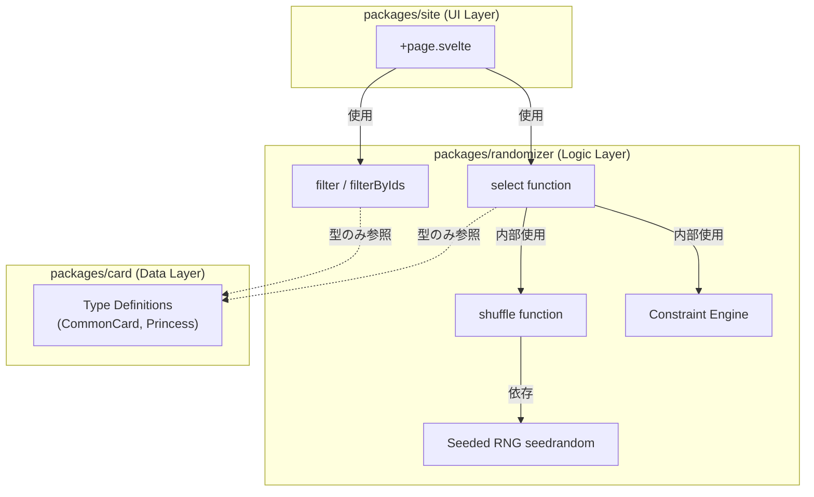

# 技術設計ドキュメント

## 概要

**目的**: 本機能は、カードゲーム「ハートオブクラウン」のランダマイズロジックを独立したテスト可能なパッケージとして提供することで、t-wada TDD手法に基づく開発を可能にし、再利用性と保守性を向上させる。

**ユーザー**: フロントエンド開発者とテストエンジニアが、決定的なランダマイズAPIを利用してカード選択ロジックをテスト駆動で実装できる。ゲームマスターは、柔軟な制約（攻撃カード除外、特定カード必須化）を適用してゲームバランスを調整できる。

**影響**: 現在`packages/site/src/routes/+page.svelte`に埋め込まれているランダマイズロジック（`Math.random()`ベース）を、`packages/randomizer/`パッケージの純粋関数APIに移行する。これにより、UIロジックとランダマイズロジックが分離され、完全なユニットテストカバレッジが実現する。

### ゴール

- 決定的ランダム化（シード値による再現可能性）をサポートする純粋関数ライブラリの提供
- Fisher-Yatesアルゴリズムによる O(n) 時間計算量のバイアスフリーシャッフル
- 制約ベースのカード選択（必須カード、プロパティベース除外）
- 100%テストカバレッジ（ユニット、プロパティベース、エッジケース）
- 既存siteパッケージへのシームレス統合

### 非ゴール

- UIコンポーネント の提供（ランダマイズロジックのみ）
- カードデータの管理（`@heart-of-crown-randomizer/card`パッケージが責任）
- 暗号学的に安全な乱数生成（ゲーム用途のため不要）
- リアルタイム同期やネットワーク通信（ローカルロジックのみ）

## アーキテクチャ

### 既存アーキテクチャ分析

**現在の構造**:
- モノレポ: pnpm workspace + Turborepo
- `@heart-of-crown-randomizer/card`: カードデータライブラリ（tsdownビルド、ゼロ依存）
- `@heart-of-crown-randomizer/site`: SvelteKitアプリ（Vite、Vitest）
- ランダマイズロジックは`+page.svelte`内にハードコード（`sort(() => Math.random() - 0.5)`）

**統合ポイント**:
- `site`が`randomizer`に依存（workspace:*）
- `randomizer`は`card`の型定義のみインポート（ランタイム依存なし）
- Turborepoでビルド順序を管理

### アーキテクチャパターンと境界マップ



**アーキテクチャ統合**:
- **選択パターン**: Pure Functions Library（関数型プログラミング）
- **責任分離**:
  - `randomizer`: ランダマイズロジック・制約検証
  - `site`: UI・ユーザー操作・状態管理
  - `card`: カードデータ・型定義
- **既存パターン維持**: ESM専用、TypeScript strict mode、tsdownビルド
- **新規コンポーネント根拠**: ロジックとUIの分離によりテスタビリティ向上
- **Steering準拠**: モノレポ構造、パッケージファースト、ゼロ依存原則（seedrandomのみ例外）

### 技術スタック

| Layer | Choice / Version | Role in Feature | Notes |
|-------|------------------|-----------------|-------|
| Logic Layer | TypeScript 5.9+ | 型安全な純粋関数実装 | strict mode, isolatedDeclarations必須 |
| Random Number Generation | seedrandom 3.0.5 + @types/seedrandom 3.0.8 | 決定的シード付きPRNG | research.mdで選定根拠記載 |
| Build Tool | tsdown (latest) | ESMビルド、型定義生成 | 既存cardパッケージと統一 |
| Testing | Vitest 4.0+ | ユニット・統合テスト | 既存site環境と共通 |
| Property-Based Testing | @fast-check/vitest (latest) | シャッフル不変条件テスト | research.mdで調査済み |
| Package Manager | pnpm 10.26+ | モノレポ依存管理 | 既存プロジェクトに準拠 |

> **tsdown選定理由**: 既存cardパッケージと統一、Rolldown（Rust）ベースで高速、isolatedDeclarations対応。詳細はresearch.md参照。

## 要件トレーサビリティ

| 要件 | 概要 | コンポーネント | インターフェース | フロー |
|------|------|-------------|-------------|------|
| 1.1-1.7 | パッケージ構造 | Package Config | package.json exports | - |
| 2.1-2.8 | 決定的ランダマイズ | shuffle, select, SeededRNG | shuffle(), select(), SelectOptions | shuffle → select |
| 3.1-3.4 | フィルタリング | filter, filterByIds | filter(), filterByIds() | - |
| 4.1-4.9 | 制約ベース選択 | ConstraintValidator | Constraint, validateConstraints() | select → validate → shuffle |
| 5.1-5.4 | カードデータ統合 | Generic Type Parameters | ジェネリック型 <T> | - |
| 6.1-6.9 | テストカバレッジ | Test Suites | Vitest, fast-check | - |
| 7.1-7.9 | 開発ワークフロー | TDD Process | - | Red → Green → Refactor |
| 8.1-8.5 | サイト統合 | Site Refactoring | import from randomizer | - |
| 9.1-9.4 | パフォーマンス | FisherYatesShuffle | O(n) algorithm | - |
| 10.1-10.7 | ドキュメント | README, JSDoc | - | - |

## コンポーネントとインターフェース

### コンポーネント概要

| Component | Domain/Layer | Intent | Req Coverage | Key Dependencies (P0/P1) | Contracts |
|-----------|--------------|--------|--------------|--------------------------|-----------|
| shuffle | Logic / Core | Fisher-Yatesシャッフル | 2.1-2.8, 9.1-9.4 | seedrandom (P0) | Service |
| select | Logic / Core | 制約付きカード選択 | 2.4, 4.1-4.9 | shuffle (P0), ConstraintValidator (P0) | Service |
| filter / filterByIds | Logic / Util | 述語・ID除外 | 3.1-3.4 | なし | Service |
| ConstraintValidator | Logic / Core | 制約検証エンジン | 4.7, 4.9 | なし | Service |
| SeededRNG | Logic / Infrastructure | シード付きRNG生成 | 2.1-2.2 | seedrandom (P0) | Service |

### Logic / Core

#### shuffle

| Field | Detail |
|-------|--------|
| Intent | Fisher-Yatesアルゴリズムで配列を非破壊的にシャッフル |
| Requirements | 2.1, 2.3, 2.5, 2.6, 9.2, 9.3 |

**責任と制約**:
- Fisher-Yates（Modern版）アルゴリズムで O(n) 時間計算量のシャッフル
- 入力配列を変更せず新配列を返却（純粋関数）
- シード値が与えられた場合は決定的、なければ非決定的
- 不変条件: シャッフル後の配列長さ = 元の配列長さ、要素集合は同一

**依存関係**:
- External: seedrandom — 決定的シード付きRNG生成 (P0)

**Contracts**: [x] Service

##### Service Interface

```typescript
/**
 * Shuffles array using Fisher-Yates algorithm with optional seed for deterministic results.
 *
 * @param items - Array to shuffle (not mutated)
 * @param seed - Optional seed for deterministic randomization
 * @returns New shuffled array
 * @throws {Error} If seed is NaN or Infinity
 *
 * @example
 * const cards = [1, 2, 3, 4, 5];
 * const shuffled = shuffle(cards, 42); // deterministic
 * const random = shuffle(cards);       // non-deterministic
 */
function shuffle<T>(items: T[], seed?: number): T[];
```

- **Preconditions**: seedが提供される場合、有効な数値（NaN、Infinityでない）
- **Postconditions**: 返却配列の長さ = items.length、要素集合同一、itemsは変更されない
- **Invariants**: O(n)時間計算量、O(n)空間計算量

**実装ノート**:
- **Integration**: seedrandomでRNG生成、Fisher-Yates逆方向ループ（末尾→先頭）
- **Validation**: seedがNaN/Infinityの場合はError投げる（要件2.8）
- **Risks**: 1000要素で100ms超過の可能性 → ベンチマークテストで検証

#### select

| Field | Detail |
|-------|--------|
| Intent | 制約付きでN枚のカードをランダム選択 |
| Requirements | 2.4, 2.6, 2.7, 4.1-4.9 |

**責任と制約**:
- 必須カードを優先配置、残りをシャッフルして選択
- 除外述語でフィルタリング
- 制約の競合（必須カードが除外述語に該当）を検出してエラー
- count > available items の場合は全要素を返す（エラーなし）

**依存関係**:
- Inbound: なし（公開API）
- Outbound: shuffle — カードシャッフル (P0)
- Outbound: ConstraintValidator — 制約検証 (P0)

**Contracts**: [x] Service

##### Service Interface

```typescript
/**
 * Options for select function
 */
interface SelectOptions<T> {
  /** Optional seed for deterministic selection */
  seed?: number;
  /** Constraints for card selection */
  constraints?: Constraint<T>;
}

/**
 * Constraint definition for card selection
 */
interface Constraint<T> {
  /** Array of exclusion predicates (OR logic: any match excludes card) */
  exclude?: Array<(item: T) => boolean>;
  /** Array of required cards (must be included in result) */
  require?: T[];
}

/**
 * Selects N cards from items with optional constraints.
 *
 * @param items - Array of cards to select from
 * @param count - Number of cards to select
 * @param options - Selection options (seed, constraints)
 * @returns Selected cards array
 * @throws {Error} If required cards are excluded by predicates (conflict)
 * @throws {Error} If seed is invalid (NaN, Infinity)
 *
 * @example
 * const cards = [...allCards];
 * const selected = select(cards, 10, {
 *   seed: 42,
 *   constraints: {
 *     exclude: [card => card.mainType.includes('attack')],
 *     require: [specificCard]
 *   }
 * });
 */
function select<T>(
  items: T[],
  count: number,
  options?: SelectOptions<T>
): T[];
```

- **Preconditions**: count >= 0、制約が矛盾していない
- **Postconditions**: 返却配列長さ <= count、必須カードがすべて含まれる、除外述語に該当するカードは含まれない
- **Invariants**: itemsは変更されない

**実装ノート**:
- **Integration**:
  1. ConstraintValidator.validate()で制約検証
  2. exclude述語でフィルタリング
  3. require配列を結果に追加
  4. 残り枠をshuffle()で選択
- **Validation**: 制約競合時は詳細なエラーメッセージ
- **Risks**: 制約ロジックの複雑性 → TDDで段階的実装

#### filter / filterByIds

| Field | Detail |
|-------|--------|
| Intent | 述語またはID除外でカードをフィルタリング |
| Requirements | 3.1-3.4 |

**責任と制約**:
- 述語関数で汎用フィルタリング
- ID配列で特定カードを除外
- 入力配列を変更しない

**依存関係**: なし

**Contracts**: [x] Service

##### Service Interface

```typescript
/**
 * Filters items by predicate (keeps items where predicate returns true).
 *
 * @param items - Array to filter
 * @param predicate - Filter function (true = keep)
 * @returns New filtered array
 *
 * @example
 * const nonAttackCards = filter(cards, card => !card.mainType.includes('attack'));
 */
function filter<T>(items: T[], predicate: (item: T) => boolean): T[];

/**
 * Filters out items with specified IDs.
 *
 * @param items - Array with id property
 * @param excludedIds - IDs to exclude
 * @returns New filtered array
 *
 * @example
 * const filtered = filterByIds(cards, [1, 5, 10]); // excludes cards with id 1, 5, 10
 */
function filterByIds<T extends { id: number }>(items: T[], excludedIds: number[]): T[];
```

- **Preconditions**: なし
- **Postconditions**: 返却配列は述語条件を満たす要素のみ、itemsは変更されない
- **Invariants**: O(n)時間計算量

**実装ノート**:
- **Integration**: Array.prototype.filter()のラッパー
- **Validation**: なし（predicateのバリデーションは呼び出し側責任）
- **Risks**: なし（シンプルな実装）

#### ConstraintValidator

| Field | Detail |
|-------|--------|
| Intent | 制約の矛盾を検出してエラーを投げる |
| Requirements | 4.7, 4.9 |

**責任と制約**:
- 必須カードが除外述語に該当しないかチェック
- 矛盾検出時は詳細なエラーメッセージ（どのカードが競合しているか）

**依存関係**: なし

**Contracts**: [x] Service

##### Service Interface

```typescript
/**
 * Validates constraints for conflicts.
 *
 * @param constraint - Constraint to validate
 * @throws {ConstraintConflictError} If required cards are excluded by predicates
 *
 * @example
 * validateConstraints({
 *   exclude: [card => card.mainType.includes('attack')],
 *   require: [attackCard] // throws error: required card excluded
 * });
 */
function validateConstraints<T>(constraint: Constraint<T>): void;

/**
 * Custom error for constraint conflicts
 */
class ConstraintConflictError extends Error {
  constructor(message: string, public conflictingItems: unknown[]) {
    super(message);
    this.name = 'ConstraintConflictError';
  }
}
```

- **Preconditions**: constraintが定義されている
- **Postconditions**: 矛盾がなければ何もしない、矛盾があればエラー投げる
- **Invariants**: 副作用なし（純粋関数）

**実装ノート**:
- **Integration**: select()関数内で最初に呼ばれる
- **Validation**: require配列の各要素をexclude述語で検証
- **Risks**: エラーメッセージの分かりやすさ → ユーザーフィードバックで改善

### Logic / Infrastructure

#### SeededRNG

| Field | Detail |
|-------|--------|
| Intent | seedrandomライブラリのラッパー |
| Requirements | 2.1-2.2 |

**責任と制約**:
- seedrandomライブラリでRNG生成
- seedなしの場合はMath.random()を使用

**依存関係**:
- External: seedrandom — seeded random number generator (P0)

**Contracts**: [x] Service

##### Service Interface

```typescript
/**
 * Creates RNG function (seeded or non-seeded).
 *
 * @param seed - Optional seed value
 * @returns Random number generator function (0-1)
 *
 * @example
 * const rng = createRNG(42);   // deterministic
 * const random = createRNG();  // non-deterministic (Math.random)
 */
function createRNG(seed?: number): () => number;
```

- **Preconditions**: seedが提供される場合、有効な数値
- **Postconditions**: 0以上1未満の乱数を返す関数
- **Invariants**: 同じseedで同じ乱数列

**実装ノート**:
- **Integration**: seedrandom()またはMath.randomを返す
- **Validation**: seedバリデーションはshuffle()で実施
- **Risks**: seedrandomメンテナンス停滞 → フォークまたは代替検討

## データモデル

### ドメインモデル

本パッケージは純粋関数ライブラリのため、ドメインエンティティやアグリゲートは持たない。ジェネリック型パラメータ`<T>`により、任意の配列要素型に対応。

**型制約**:
- `filterByIds`: `T extends { id: number }` - id プロパティを持つオブジェクト
- その他の関数: 型制約なし（完全にジェネリック）

### データ契約と統合

**型定義参照（型のみインポート）**:

```typescript
// packages/randomizer/src/types.ts

/**
 * Generic predicate type for filtering
 */
export type Predicate<T> = (item: T) => boolean;

/**
 * Constraint for select function
 */
export interface Constraint<T> {
  exclude?: Predicate<T>[];
  require?: T[];
}

/**
 * Options for select function
 */
export interface SelectOptions<T> {
  seed?: number;
  constraints?: Constraint<T>;
}

/**
 * Item with id property (for filterByIds)
 */
export interface Identifiable {
  id: number;
}
```

**カードパッケージとの統合** (型のみ):

```typescript
// packages/site での使用例
import { select } from '@heart-of-crown-randomizer/randomizer';
import type { CommonCard } from '@heart-of-crown-randomizer/card/type';

const allCards: CommonCard[] = [...Basic.commons, ...FarEasternBorder.commons];
const selected = select<CommonCard>(allCards, 10, {
  seed: 42,
  constraints: {
    exclude: [card => card.mainType.includes('attack')],
  }
});
```

## エラーハンドリング

### エラー戦略

明示的なエラー投げとTypeScript型システムによるコンパイル時検証の組み合わせ。

### エラーカテゴリと応答

**ユーザーエラー（入力検証）**:
- **無効なシード値（NaN, Infinity）**: `Error` - "Invalid seed: seed must be a finite number"
- **制約競合（必須カードが除外述語に該当）**: `ConstraintConflictError` - "Constraint conflict: required cards [ids] are excluded by predicates"

**システムエラー**:
- なし（外部システムへの依存なし、すべてメモリ内処理）

**ビジネスロジックエラー**:
- なし（制約競合のみ）

### モニタリング

- ユニットテストでエラーケースを網羅
- エラーメッセージの明確性をテストで検証
- 本番環境ではサイトパッケージが責任（randomizerパッケージはロガー不要）

## テスト戦略

### テストファイル配置

**コロケーションパターン**:
- テストファイルはソースコードと同じディレクトリに配置
- 命名規則: `{filename}.test.ts` （例: `shuffle.ts` → `shuffle.test.ts`）
- 理由: テストとソースの密結合により保守性向上、ファイル移動時の追跡が容易

### ユニットテスト

**shuffle関数**:
- 空配列、単一要素、重複要素
- シード付き決定性（同じシード→同じ結果）
- シードなし非決定性（異なる結果）
- 無効シード（NaN, Infinity）でエラー
- 入力配列の非破壊性

**select関数**:
- count > 利用可能要素（全要素返却）
- count = 0（空配列返却）
- 必須カードが優先配置
- 除外述語が正しく動作
- 制約競合でエラー

**filter/filterByIds関数**:
- 空配列、全要素マッチ、全要素不一致
- ID除外の正確性

**ConstraintValidator**:
- 矛盾なし（正常）
- 矛盾あり（エラー）
- エラーメッセージの詳細性

### プロパティベーステスト（fast-check）

**シャッフル不変条件**:
- `fc.array(fc.anything())` で任意配列生成
- プロパティ: `shuffled.length === original.length`
- プロパティ: `shuffled.sort() === original.sort()` （要素集合同一）
- プロパティ: 同じシード→同じ結果

**select不変条件**:
- プロパティ: `selected.length <= count`
- プロパティ: 必須カードがすべて含まれる
- プロパティ: 除外述語に該当するカードが含まれない

### 統合テスト

**サイトパッケージとの統合**:
- `+page.svelte`のリファクタリング後、既存テストスイート実行
- 手動テスト: ブラウザで動作確認、URL復元機能確認

### パフォーマンステスト

**ベンチマーク**:
- 1000要素シャッフルを100ms以内で完了（要件9.1）
- 100要素 × 1000回シャッフルの平均時間
- メモリ使用量の測定（O(n)空間計算量確認）

## パフォーマンスとスケーラビリティ

### ターゲットメトリクス

- **シャッフル時間**: 1000要素 < 100ms (要件9.1)
- **時間計算量**: O(n) (要件9.2)
- **空間計算量**: O(n) (要件9.3) - 新配列作成による
- **不要な配列割り当て**: なし (要件9.4) - Fisher-Yates1パスのみ

### 最適化手法

- **Fisher-Yates逆方向ループ**: キャッシュ効率向上
- **seedrandomキャッシュ**: 同じシードのRNG再利用（将来拡張）
- **制約検証の早期終了**: 最初の競合で即座にエラー

### ベンチマーク戦略

```typescript
// ベンチマークテスト例
import { describe, it, expect } from 'vitest';
import { shuffle } from './shuffle';

describe('Performance Benchmark', () => {
  it('shuffles 1000 items within 100ms', () => {
    const items = Array.from({ length: 1000 }, (_, i) => i);
    const start = performance.now();
    shuffle(items);
    const duration = performance.now() - start;
    expect(duration).toBeLessThan(100);
  });
});
```

## ドキュメンテーション

### README.md

**セクション構成**:
1. Overview - パッケージの目的、主要機能
2. Installation - `pnpm add @heart-of-crown-randomizer/randomizer`
3. Quick Start - 基本的な使用例
4. API Reference - 各関数のシグネチャと説明
5. Advanced Usage - 制約ベース選択、決定的テスト
6. TypeScript Support - 型定義、ジェネリック型
7. Performance - ベンチマーク結果
8. License - Zlib

**使用例**:

```typescript
// 基本的なシャッフル
import { shuffle } from '@heart-of-crown-randomizer/randomizer';
const cards = [1, 2, 3, 4, 5];
const shuffled = shuffle(cards, 42); // deterministic

// 制約付き選択
import { select } from '@heart-of-crown-randomizer/randomizer';
const selected = select(cards, 3, {
  constraints: {
    exclude: [card => card.cost > 5],
    require: [specificCard]
  }
});

// 決定的テスト
import { shuffle } from '@heart-of-crown-randomizer/randomizer';
test('shuffle with seed is deterministic', () => {
  const cards = [1, 2, 3];
  const result1 = shuffle(cards, 42);
  const result2 = shuffle(cards, 42);
  expect(result1).toEqual(result2);
});
```

### JSDoc

すべての公開関数に包括的なJSDocコメントを付与:
- `@param` - パラメータ説明と型
- `@returns` - 返却値の説明と型
- `@throws` - 投げる可能性のあるエラー
- `@example` - 使用例コード

## 移行戦略

### フェーズ1: パッケージ作成

1. `packages/randomizer/` ディレクトリ作成
2. package.json、tsconfig.json、vitest.config.ts 設定
3. コア関数実装（TDD）
4. テストスイート作成
5. ビルド確認

### フェーズ2: サイト統合

1. `packages/site/package.json` に依存追加
2. `+page.svelte` の `drawRandomCards()` リファクタリング
3. `drawMissingCommons()` リファクタリング
4. 既存テストスイート実行
5. 手動テスト（ブラウザ動作確認）

### フェーズ3: 制約機能追加（将来拡張）

1. Constraint Engine実装
2. UI側での制約設定機能（オプション）
3. ドキュメント更新

### ロールバック戦略

- Git revert でコミット単位で巻き戻し
- パッケージ依存削除で旧実装に復帰可能
- フェーズ2完了まで旧ロジックは削除しない

## サポート参照

### TypeScript型定義（完全版）

```typescript
// packages/randomizer/src/index.ts
export type Predicate<T> = (item: T) => boolean;

export interface Constraint<T> {
  exclude?: Predicate<T>[];
  require?: T[];
}

export interface SelectOptions<T> {
  seed?: number;
  constraints?: Constraint<T>;
}

export interface Identifiable {
  id: number;
}

export class ConstraintConflictError<T = unknown> extends Error {
  constructor(message: string, public readonly conflictingItems: T[]) {
    super(message);
    this.name = 'ConstraintConflictError';
  }
}

export function shuffle<T>(items: T[], seed?: number): T[];
export function select<T>(items: T[], count: number, options?: SelectOptions<T>): T[];
export function filter<T>(items: T[], predicate: Predicate<T>): T[];
export function filterByIds<T extends Identifiable>(items: T[], excludedIds: number[]): T[];
export function createRNG(seed?: number): () => number;
export function validateConstraints<T>(constraint: Constraint<T>): void;
```

### package.json（完全版）

```json
{
  "name": "@heart-of-crown-randomizer/randomizer",
  "version": "1.0.0",
  "description": "Testable card randomization library with deterministic seeding",
  "keywords": ["randomizer", "shuffle", "seeded", "tdd", "heart-of-crown"],
  "license": "Zlib",
  "type": "module",
  "exports": {
    ".": {
      "types": "./dist/index.d.mts",
      "import": "./dist/index.mjs"
    }
  },
  "main": "dist/index.mjs",
  "types": "dist/index.d.mts",
  "scripts": {
    "build": "tsdown",
    "check": "npm-run-all check:*",
    "check:code": "biome check .",
    "check:fmt": "biome format .",
    "check:type": "tsc --noEmit",
    "clean": "rimraf dist",
    "test": "vitest run",
    "test:watch": "vitest",
    "test:coverage": "vitest run --coverage"
  },
  "dependencies": {
    "seedrandom": "^3.0.5"
  },
  "devDependencies": {
    "@fast-check/vitest": "latest",
    "@types/seedrandom": "^3.0.8",
    "tsdown": "catalog:",
    "vitest": "catalog:"
  }
}
```

### tsconfig.json

```json
{
  "extends": "../../tsconfig.json",
  "compilerOptions": {
    "outDir": "./dist",
    "rootDir": "./src",
    "isolatedDeclarations": true
  },
  "include": ["src/**/*"],
  "exclude": ["node_modules", "dist", "**/*.test.ts"]
}
```
