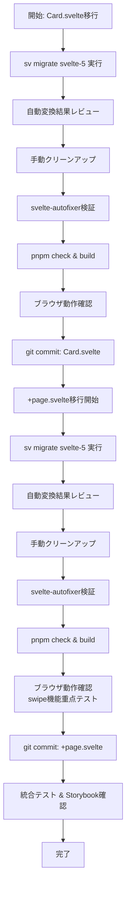
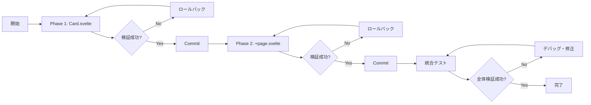

# 技術設計書: Svelte 5移行

## Overview

本機能は、Heart of Crown RandomizerアプリケーションのSvelteコンポーネントをSvelte 4構文からSvelte 5構文に移行します。これにより、最新のSvelteフレームワーク機能 (runes) を活用しつつ、アプリケーションの既存の動作と見た目を完全に保持します。

**Purpose**: Svelte 5 runesベースの最新構文への移行により、コードの保守性と将来の拡張性を向上させる。

**Users**: 開発者が対象。エンドユーザーには変更が見えない (動作・見た目は完全に同一)。

**Impact**: 既存のSvelte 4構文を使用している2つのコンポーネント (Card.svelte、+page.svelte) をSvelte 5構文に変換します。+layout.svelteは既に移行済みのため対象外です。

### Goals

- Card.svelteと+page.svelteをSvelte 5構文に完全移行
- 既存の動作・見た目・機能を100%保持 (リグレッションゼロ)
- TypeScript strict modeの型安全性を維持
- legacy依存を排除し、クリーンなSvelte 5コードを実現
- ファイル単位でのCommitによる段階的移行と検証

### Non-Goals

- 新機能の追加やUIの改善
- パフォーマンス最適化 (移行に伴う副次的な改善は除く)
- テストカバレッジの拡大 (既存テストの動作確認のみ)
- +layout.svelteの再移行 (既に完了済み)
- 依存関係のバージョンアップ (既にSvelte 5対応済み)

## Architecture

### Existing Architecture Analysis

**現在のアーキテクチャパターン**:
- コンポーネントローカルstate管理 (Svelte 4の`let`宣言)
- `$:` reactive statementsによる派生値計算
- `export let`によるpropsの定義
- `on:`ディレクティブによるイベント処理
- `onMount`ライフサイクルフックによる副作用処理

**移行対象コンポーネント**:

| Component | Location | Complexity | Status |
|-----------|----------|------------|--------|
| Card.svelte | `packages/site/src/lib/Card.svelte` | 中 (7 props, 2 reactive, 6 events) | 移行必要 |
| +page.svelte | `packages/site/src/routes/+page.svelte` | 高 (15+ state, 2 reactive, onMount, localStorage) | 移行必要 |
| +layout.svelte | `packages/site/src/routes/+layout.svelte` | 低 (既にSvelte 5) | 完了済み |

**既存の統合ポイント**:
- Card.svelteは+page.svelteから使用される子コンポーネント
- +page.svelteはlocalStorageとURL (searchParams) に依存
- すべてのコンポーネントはTailwind CSS v4を使用

**技術的制約**:
- TypeScript strict mode必須
- Biome (TypeScript) + Prettier (Svelte) によるフォーマット維持
- pnpm workspaceのmonorepo構造
- Vitestテスト設定はコメントアウト済み (手動テストが中心)

### Architecture Pattern & Boundary Map

**選択パターン**: Component-by-Component Migration (コンポーネント単位の段階的移行)

```mermaid
graph TB
    subgraph "Migration Phases"
        Phase1[Phase 1: Card.svelte Migration]
        Phase2[Phase 2: +page.svelte Migration]
        Complete[Phase 3: Validation & Cleanup]
    end

    subgraph "Components After Migration"
        Layout[+layout.svelte<br/>Svelte 5 - Already Done]
        Page[+page.svelte<br/>Svelte 5 - To Migrate]
        Card[Card.svelte<br/>Svelte 5 - To Migrate]
    end

    subgraph "External Dependencies"
        CardData[@heart-of-crown-randomizer/card]
        LocalStorage[localStorage API]
        URLParams[URL searchParams]
    end

    Phase1 --> Card
    Phase2 --> Page
    Card --> Phase2
    Page --> Layout
    Page --> Card
    Page --> CardData
    Page --> LocalStorage
    Page --> URLParams

    Complete --> Layout
    Complete --> Page
    Complete --> Card
```

**アーキテクチャ統合**:
- **選択パターン**: ハイブリッドアプローチ (sv migrate自動変換 + 手動クリーンアップ)
- **境界の保持**:
  - Card.svelteは独立したプレゼンテーショナルコンポーネントとして境界を維持
  - +page.svelteはページレベルのステート管理とビジネスロジックの境界を維持
  - localStorageとの境界は`$effect()`内に隔離
- **新コンポーネント**: なし (既存コンポーネントの構文変換のみ)
- **ステアリング準拠**: Monorepo構造、型安全性、package-first設計を維持

### Technology Stack

| Layer | Choice / Version | Role in Feature | Notes |
|-------|------------------|-----------------|-------|
| Frontend Framework | Svelte 5.46.0 | コンポーネントのリアクティブシステム | 既に導入済み、パッケージ更新不要 |
| Build Tool | SvelteKit 2.49.2 | アプリケーションフレームワーク | 既に導入済み |
| Build System | Vite 6.x + Turborepo | バンドルとmonorepo調整 | 既存設定を維持 |
| Type System | TypeScript 5.9.3 (strict mode) | 型安全性の保証 | 既存のstrict mode設定を維持 |
| Code Quality | Biome (TS) + Prettier (Svelte) | コードフォーマットとlint | 既存設定を維持 |
| Testing | Vitest + Testing Library 5.2.9 | コンポーネントテスト | Svelte 5対応版導入済み |
| UI Development | Storybook 10.1.10 | コンポーネント視覚検証 | Svelte 5対応版導入済み |
| Migration Tool | sv migrate (svelte-migrate) | 自動構文変換 | 公式CLIツール |
| Validation Tool | svelte-autofixer (svelte MCP) | Svelte 5構文検証 | MCPサーバー経由でアクセス |

**重要な技術的決定**:
- **sv migrate**: 初期変換を自動化、基本的な構文変換を処理
- **手動クリーンアップ**: legacy import削除、イベント修飾子の直接実装化
- **svelte-autofixer**: 構文の正確性を検証、Svelte 5ベストプラクティスをチェック

## System Flows

### Migration Process Flow



**フロー決定事項**:
- 子コンポーネント (Card.svelte) から親コンポーネント (+page.svelte) への順序で移行
- 各コンポーネント移行後に即座にcommit、問題発生時のロールバックを容易に
- 自動変換後の手動クリーンアップフェーズでlegacy依存を排除
- 各フェーズで複数の検証レイヤー (autofixer → build → 手動テスト) を実施

## Requirements Traceability

| Requirement | Summary | Components | Interfaces | Implementation Note |
|-------------|---------|------------|------------|---------------------|
| 1.1 | svelte-mcpツールによるSvelte 4→5構文変換 | MigrationProcess | sv migrate CLI, svelte-autofixer | 自動変換 + 手動検証 |
| 1.2 | $: → $derived()/$effect() | Card.svelte, +page.svelte | $derived, $effect | 純粋計算は$derived、副作用は$effect |
| 1.3 | export let → $props() | Card.svelte, +page.svelte | $props | 分割代入で型安全に受け取り |
| 1.4 | ストア構文の維持 | なし | なし | ストア未使用のため該当なし |
| 1.5 | on:event → onevent | Card.svelte, +page.svelte | Event handlers | イベント修飾子は手動実装 |
| 1.6 | TypeScript型安全性の保持 | すべて | TypeScript types | strict mode維持、pnpm checkで検証 |
| 2.1-2.5 | 動作・見た目の保持 | Card.svelte, +page.svelte | 既存API | リグレッションテストで確認 |
| 3.1 | 単一コンポーネント移行 | Card.svelte → +page.svelte | Git commits | 依存順序で段階的移行 |
| 3.2 | ファイル単位commit | MigrationProcess | Git | Conventional Commits形式 |
| 3.3 | Conventional Commits | MigrationProcess | Git commit message | `refactor(svelte): migrate [component] to Svelte 5 syntax` |
| 3.4 | 移行順序遵守 | Card.svelte, +page.svelte | なし | Card → +page (+layoutは完了済み) |
| 3.5 | ビルド・テスト成功確認 | MigrationProcess | pnpm scripts | 各移行後にcheck & build |
| 4.1-4.5 | コード品質維持 | すべて | Biome, Prettier | 既存フォーマット設定維持 |
| 5.1-5.5 | ビルドと依存関係 | 該当なし | package.json | 依存関係は既に最新、更新不要 |
| 6.1-6.5 | テストとバリデーション | MigrationProcess | Vitest, Storybook | 手動テスト中心、Storybookで視覚確認 |

## Components and Interfaces

### Summary

| Component | Domain/Layer | Intent | Req Coverage | Key Dependencies | Contracts |
|-----------|--------------|--------|--------------|------------------|-----------|
| Card.svelte | UI/Presentation | カード表示コンポーネント | 1.2, 1.3, 1.5, 1.6, 2.1-2.5 | CommonCard型 (P0) | Props, Events |
| +page.svelte | Page/Container | ページロジックと状態管理 | 1.2, 1.3, 1.5, 1.6, 2.1-2.5, 3.1 | Card.svelte (P0), localStorage (P1), CardData (P0) | Props, State, Effects |
| MigrationProcess | Process/Workflow | 移行プロセス全体の制御 | 3.1-3.5, 4.1-4.5, 6.1-6.5 | sv migrate (P0), git (P0) | CLI, Scripts |

### UI Layer

#### Card.svelte

| Field | Detail |
|-------|--------|
| Intent | 個別カードを表示し、スワイプ削除とキーボード削除のインタラクションを提供 |
| Requirements | 1.2, 1.3, 1.5, 1.6, 2.1, 2.4, 2.5 |

**Responsibilities & Constraints**:
- カード情報 (CommonCard型) の視覚表示
- スワイプイベント (mouse/touch) の伝播
- 削除ボタンとキーボード削除のハンドリング
- エディション別のスタイリング (border, text color)
- リンク情報に基づくハイライト表示

**Dependencies**:
- Inbound: +page.svelte — props渡し、イベントコールバック (P0)
- Inbound: @heart-of-crown-randomizer/card/type — CommonCard型定義 (P0)
- Outbound: なし

**Contracts**: Props [x] / Events [x]

##### Props Interface

```typescript
interface CardProps {
  // Card data
  common: CommonCard;

  // Event callbacks
  onRemove: (index: number) => void;
  onSwipeStart: (e: MouseEvent | TouchEvent, index: number) => void;
  onSwipeMove: (e: TouchEvent | MouseEvent) => void;
  onSwipeEnd: () => void;
  onSwipeCancel: () => void;

  // Metadata
  originalIndex: number;
}
```

**Svelte 4 → Svelte 5変換**:

| Svelte 4構文 | Svelte 5構文 | 変換理由 |
|--------------|--------------|----------|
| `export let common: CommonCard;` | `let { common, onRemove, ... } = $props<CardProps>();` | Props受け取りの標準パターン |
| `$: borderColor = ...` | `const borderColor = $derived(...)` | 純粋な計算、副作用なし |
| `$: textColor = ...` | `const textColor = $derived(...)` | 純粋な計算、副作用なし |
| `on:mousedown={(e) => ...}` | `onmousedown={(e) => ...}` | イベント属性への変換 |
| `on:keydown={(e) => ...}` | `onkeydown={(e) => ...}` | イベント属性への変換 |

##### Event Handlers

親コンポーネント (+page.svelte) から受け取ったコールバック関数をそのまま使用:
- `onRemove(originalIndex)`: 削除ボタンまたはキーボード削除時
- `onSwipeStart(e, originalIndex)`: マウス/タッチ開始時
- `onSwipeMove(e)`: スワイプ移動時
- `onSwipeEnd()`: スワイプ終了時
- `onSwipeCancel()`: スワイプキャンセル時

**Implementation Notes**:
- **Integration**: sv migrate実行後、legacy importがなければそのまま使用可能
- **Validation**: svelte-autofixi検証、`$derived()`が適切に使用されているか確認
- **Risks**: イベントハンドラーの伝播が正しく動作するか要テスト

#### +page.svelte

| Field | Detail |
|-------|--------|
| Intent | カードランダマイザーのメインページロジック、状態管理、UI制御 |
| Requirements | 1.2, 1.3, 1.5, 1.6, 2.1-2.5, 3.1 |

**Responsibilities & Constraints**:
- カード選択ロジック (ランダム抽選、追加、削除)
- スワイプ削除機能の実装
- localStorage統合 (除外カードリストの永続化)
- URL同期 (searchParamsへのカードID反映)
- UI状態管理 (選択カード、除外カード、スワイプ状態)

**Dependencies**:
- Inbound: $app/navigation — `goto`, `page` (P0)
- Inbound: @heart-of-crown-randomizer/card — Basic, FarEasternBorder (P0)
- Inbound: @heart-of-crown-randomizer/card/type — CommonCard型 (P0)
- Inbound: svelte — `onMount` → `$effect` (P0)
- Outbound: Card.svelte — コンポーネントインスタンス化 (P0)
- External: localStorage — 除外カードの永続化 (P1)
- External: URL searchParams — 選択カードの共有 (P1)

**Contracts**: State [x] / Effects [x] / Events [x]

##### State Management

```typescript
// Svelte 5構文での状態定義
let numberOfCommons = $state(10);
let selectedCommons = $state<CommonCard[]>([]);
let shareUrl = $state("");
let excludedCommons = $state<CommonCard[]>([]);

// swipeStateはオブジェクト全体を$state()化
const swipeState = $state({
  startX: 0,
  startY: 0,
  currentX: 0,
  isDragging: false,
  cardElement: null as HTMLElement | null,
  cardIndex: -1,
  threshold: 100
});
```

**Svelte 4 → Svelte 5変換**:

| Svelte 4構文 | Svelte 5構文 | 変換理由 |
|--------------|--------------|----------|
| `let numberOfCommons = 10;` | `let numberOfCommons = $state(10);` | リアクティブな状態 |
| `let selectedCommons = [];` | `let selectedCommons = $state([]);` | リアクティブな配列 |
| `let swipeState = { ... };` | `const swipeState = $state({ ... });` | オブジェクト全体をリアクティブ化 |
| `$: basicCards = selectedCommons.filter(...)` | `const basicCards = $derived(selectedCommons.filter(...))` | 純粋な派生値 |
| `$: farEasternCards = selectedCommons.filter(...)` | `const farEasternCards = $derived(selectedCommons.filter(...))` | 純粋な派生値 |
| `onMount(() => { ... })` | `$effect(() => { ... })` | 初回マウント時の副作用 |

##### Effect Contracts

**localStorage同期**:
```typescript
$effect(() => {
  // 初回マウント時にlocalStorageから除外カードを読み込み
  const stored = localStorage.getItem("excludedCommons");
  if (stored) {
    excludedCommons = JSON.parse(stored);
  }
});

// 除外カードの変更をlocalStorageに保存 (既存の関数内で実行)
function removeFromExcludedCommons(common: CommonCard) {
  excludedCommons = excludedCommons.filter((c) => c.id !== common.id);
  localStorage.setItem("excludedCommons", JSON.stringify(excludedCommons));
}
```

**URL同期**:
```typescript
// updateShareUrl関数内で実行 (既存のまま)
function updateShareUrl() {
  if (selectedCommons.length > 0) {
    shareUrl = `${window.location.origin}?${cardsToQuery(selectedCommons)}`;
  }
}
```

##### Event Handlers

スワイプ機能のイベントハンドラー (既存ロジックを維持):
- `handleSwipeStart`: タッチ/マウス開始、初期座標記録
- `handleSwipeMove`: 移動時の座標追跡、カードのtransform更新
- `handleSwipeEnd`: 終了時の削除判定
- `handleSwipeCancel`: キャンセル時のリセット

**Svelte 4 → Svelte 5変換**:
- `on:click={(e) => ...}` → `onclick={(e) => ...}`
- イベント修飾子なし (既存コードに修飾子使用なし)

**Implementation Notes**:
- **Integration**: swipeStateの`$state()`化がキーポイント、オブジェクト全体をラップ
- **Validation**: `$derived()`と`$effect()`の使い分けを確認、特にlocalStorage操作が`$effect()`内にあるか
- **Risks**:
  - swipe機能の動作確認が最優先 (モバイルデバイスでテスト必須)
  - localStorage読み込みタイミングが適切か確認
  - URL同期が正しく動作するか確認

### Process Layer

#### MigrationProcess

| Field | Detail |
|-------|--------|
| Intent | Svelte 4→5移行プロセス全体の実行と検証 |
| Requirements | 3.1-3.5, 4.1-4.5, 6.1-6.5 |

**Responsibilities & Constraints**:
- sv migrateツールの実行
- 自動変換結果のレビューと手動クリーンアップ
- svelte-autofixi検証の実行
- ビルド・テスト・lint実行
- git commitの作成 (Conventional Commits形式)

**Dependencies**:
- External: sv migrate CLI — 自動構文変換 (P0)
- External: svelte-autofixer (MCP) — 構文検証 (P1)
- External: git — バージョン管理 (P0)
- External: pnpm — ビルド・テスト実行 (P0)

**Contracts**: CLI [x] / Scripts [x]

##### CLI Interface

```bash
# Phase 1: Card.svelte移行
npx sv migrate svelte-5 packages/site/src/lib/Card.svelte
# 手動クリーンアップ (legacy import削除)
# svelte-autofixer検証
pnpm check
pnpm build
# ブラウザ動作確認
git add packages/site/src/lib/Card.svelte
git commit -m "refactor(svelte): migrate Card.svelte to Svelte 5 syntax

- Convert export let to $props()
- Convert reactive statements to $derived()
- Convert event directives to event attributes
- Remove legacy imports
- Verify TypeScript types and build"

# Phase 2: +page.svelte移行
npx sv migrate svelte-5 packages/site/src/routes/+page.svelte
# 手動クリーンアップ
# svelte-autofixer検証
pnpm check
pnpm build
# ブラウザ動作確認 (swipe機能重点)
git add packages/site/src/routes/+page.svelte
git commit -m "refactor(svelte): migrate +page.svelte to Svelte 5 syntax

- Convert let declarations to $state()
- Convert reactive blocks to $derived()
- Convert onMount to $effect()
- Wrap swipeState object in $state()
- Convert event directives to event attributes
- Verify localStorage and URL sync
- Test swipe functionality"
```

##### Scripts Interface

```json
{
  "check": "svelte-kit sync && svelte-check --tsconfig ./tsconfig.json",
  "build": "vite build",
  "dev": "vite dev",
  "fmt": "prettier --write .",
  "test:unit": "vitest"
}
```

**手動クリーンアップチェックリスト**:
1. `svelte/legacy`からのimportを削除
2. イベント修飾子を直接実装に置き換え (該当する場合)
3. `$derived()`と`$effect()`の使い分けを確認
4. TypeScript型定義が正確か確認
5. コメントとコードが英語で記述されているか確認

**Implementation Notes**:
- **Integration**: sv migrateの出力を慎重にレビュー、特に`run()`関数が生成された場合は手動で`$effect()`に置き換え
- **Validation**: 各フェーズで複数レイヤーの検証 (autofixer → check → build → manual test)
- **Risks**: 自動変換が完璧ではないため、手動レビューが必須

## Data Models

本機能はデータモデルの変更を伴いません。既存のCommonCard型定義を維持します。

### Domain Model

既存のドメインモデルを維持:
- **CommonCard**: カードのプロパティ (id, name, cost, coin, succession, edition, link, hasChild)
- **Edition**: 列挙型 (BASIC, FAR_EASTERN_BORDER)

Svelte 5移行による変更はありません。

### Logical Data Model

**localStorage構造** (既存のまま):
```typescript
{
  "excludedCommons": CommonCard[] // JSON serialized
}
```

**URL searchParams構造** (既存のまま):
```
?card=1&card=2&card=5
```

Svelte 5移行による変更はありません。

## Error Handling

### Error Strategy

移行プロセスにおけるエラー処理:

1. **構文エラー**: sv migrate実行時のエラー → ログ確認、手動修正
2. **型エラー**: pnpm check実行時のエラー → TypeScript型定義を修正
3. **ビルドエラー**: pnpm build実行時のエラー → コンポーネント構文を修正
4. **ランタイムエラー**: ブラウザ動作確認時のエラー → リアクティビティの問題を調査

### Error Categories and Responses

**構文変換エラー**:
- sv migrateが特定の構文を変換できない場合
- 対応: エラーメッセージを確認し、該当箇所を手動で変換
- 例: 複雑な`$:`文が`run()`関数に変換された場合、`$effect()`または`$derived()`に手動で置き換え

**型安全性エラー**:
- `$props()`の型定義が不正確な場合
- 対応: 明示的な型注釈を追加 `let { prop } = $props<Type>()`
- strict modeを維持し、`any`型は使用しない

**リアクティビティエラー**:
- 状態更新が画面に反映されない場合
- 対応: `$state()`、`$derived()`、`$effect()`の使い分けを再確認
- swipeStateのようなオブジェクトが適切に`$state()`化されているか確認

**動作確認エラー**:
- 既存機能が正常に動作しない場合
- 対応: 変更をロールバックし、段階的に再移行
- 特にswipe機能、localStorage同期、URL同期を重点的にテスト

### Monitoring

開発段階でのモニタリング:
- ブラウザコンソールでのエラーログ確認
- svelte-autofixerの警告メッセージ確認
- pnpm checkの型エラー出力確認
- Vitestテスト結果 (既存テストが動作するか)

## Testing Strategy

### Unit Tests

既存のVitest単体テストが引き続き動作することを確認:

1. **+page.svelte basic rendering** (`page.svelte.test.ts`)
   - 移行後もh1要素が正しくレンダリングされるか
   - Testing Library APIは変更なし

2. **Card.svelte props rendering**
   - `$props()`で受け取ったpropsが正しく表示されるか
   - CommonCard型のプロパティが正しく反映されるか

3. **Reactive derivations**
   - `$derived()`で計算された`borderColor`と`textColor`が正しいか
   - エディション別のスタイリングが維持されるか

### Integration Tests

1. **Card selection flow**
   - 「一般カードを引く」ボタン→カードが表示される
   - 選択カードがURLに反映される
   - shareUrlが正しく生成される

2. **Swipe deletion**
   - カードをスワイプ→削除される
   - swipeStateの状態遷移が正しいか
   - アニメーションが正常に動作するか

3. **localStorage persistence**
   - 除外カードがlocalStorageに保存される
   - ページリロード後も除外カードが復元される
   - `$effect()`によるlocalStorage読み込みが正常に動作するか

4. **URL synchronization**
   - カード選択→URL更新
   - URLからカード復元 (searchParams読み込み)
   - `goto()`によるナビゲーションが正常に動作するか

### Manual Testing

各移行フェーズ後に実施:

1. **Card.svelte移行後**:
   - カード表示が正常か (borderColor, textColor, linkハイライト)
   - 削除ボタンが動作するか
   - キーボード削除が動作するか

2. **+page.svelte移行後**:
   - カードランダム抽選が動作するか
   - カード追加機能が動作するか
   - スワイプ削除が動作するか (モバイルデバイスまたはデバイスモードで確認)
   - 除外カードリストが動作するか
   - localStorage永続化が動作するか
   - URL共有が動作するか

3. **Storybook Visual Testing**:
   - `pnpm storybook`でStorybook起動
   - Card.svelteのストーリーが正しく表示されるか
   - 各プロパティバリエーションが正しく表示されるか

### Performance Testing

Svelte 5移行による副次的なパフォーマンス改善を確認:

1. **Reactivity performance**
   - `$derived()`による計算の効率化
   - 不要な再計算の削減

2. **Bundle size**
   - legacy import削除による軽量化

## Optional Sections

### Migration Strategy

本移行は段階的に実施し、各ファイル移行後に検証を行います。



**Phase Breakdown**:

**Phase 1: Card.svelte移行** (工数: 1-2時間)
- sv migrate実行
- export let → $props()確認
- $: → $derived()確認
- on:event → onevent確認
- svelte-autofixer検証
- pnpm check & build
- ブラウザ動作確認
- git commit

**Phase 2: +page.svelte移行** (工数: 3-5時間)
- sv migrate実行
- let → $state()確認
- swipeStateの$state()化
- onMount → $effect()確認
- $: → $derived()確認
- on:event → onevent確認
- svelte-autofixer検証
- pnpm check & build
- swipe機能の重点テスト
- localStorage・URL同期確認
- git commit

**Phase 3: Validation & Cleanup** (工数: 1-2時間)
- 統合テスト (全機能の動作確認)
- Storybook視覚検証
- 既存Vitestテスト実行
- ドキュメント更新 (必要に応じて)

**Rollback Triggers**:
- ビルドエラーが解決できない場合
- 型エラーが解決できない場合
- 重要な機能 (swipe削除、localStorage同期) が動作しない場合
- 予期しない動作変更が発生した場合

**Validation Checkpoints**:
各フェーズで以下を確認:
- ✅ svelte-autofixi: 構文警告なし
- ✅ pnpm check: 型エラーなし
- ✅ pnpm build: ビルド成功
- ✅ 手動テスト: 主要機能動作確認
- ✅ (Phase 2のみ) swipe機能の動作確認
