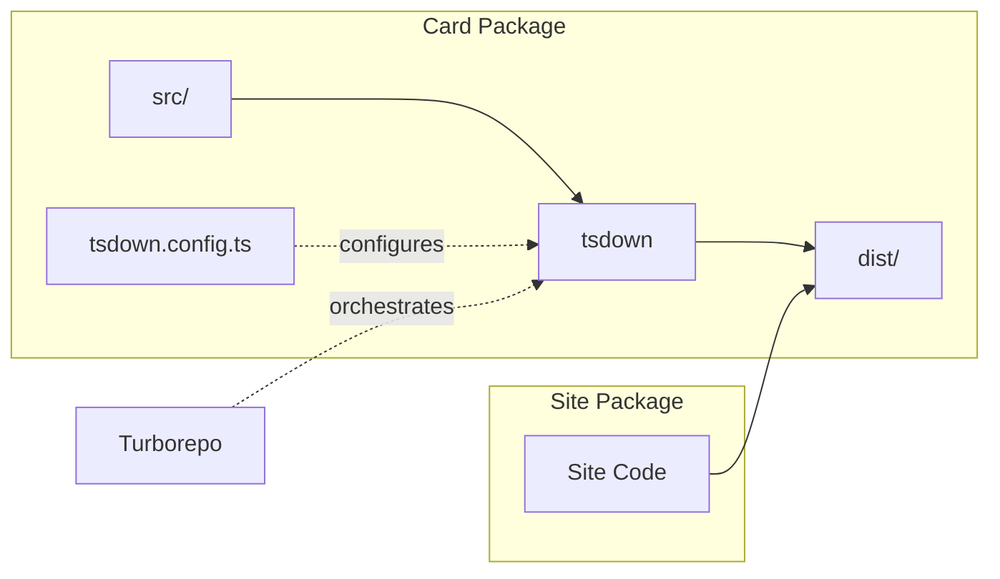

# Technical Design: tsdown-migration

## Overview

This feature migrates the `@heart-of-crown-randomizer/card` package build system from unbuild to tsdown. The card library is a TypeScript data package with zero runtime dependencies that provides card definitions organized by game expansion. The migration maintains complete backward compatibility with existing output formats while leveraging tsdown's Rust-based performance and built-in type declaration generation.

**Purpose**: Replace unbuild with tsdown as the build tool for the card package to improve build performance and reduce dependencies.

**Users**: Developers building the card package and consumers (site package) importing from the card library.

**Impact**: Changes the development build tool from unbuild to tsdown. No changes to package.json exports, source code, or consumer imports. The dist/ output format and structure remain identical.

### Goals

- Replace unbuild with tsdown in card package build pipeline
- Maintain identical dist/ output format (.mjs + .d.ts files)
- Preserve directory structure for all 10 package exports
- Eliminate vite-plugin-dts dependency using tsdown's built-in declarations
- Ensure Turborepo integration continues to function
- Maintain TypeScript strict mode compliance

### Non-Goals

- Changing package.json export paths or structure
- Modifying source code or type definitions
- Adding new build output formats (CJS, IIFE)
- Optimizing bundle size or tree-shaking beyond current behavior
- Migrating other packages in the monorepo

## Architecture

### Existing Architecture Analysis

**Current Build System**:
- Tool: unbuild 3.6.1 with vite-plugin-dts 4.5.4
- Configuration: Zero explicit config (inferred from package.json)
- Build script: `"build": "unbuild"`
- Output: ESM .mjs files + TypeScript .d.ts declarations in dist/
- Structure: Mirrors src/ directory layout

**Package Structure**:
- 10 entry points across 2 expansions (Basic, Far Eastern Border)
- Source files: `src/index.ts`, `src/basic/*.ts`, `src/far-eastern-border/*.ts`, `src/type.ts`
- Output files: `dist/index.mjs`, `dist/basic/*.mjs`, `dist/far-eastern-border/*.mjs`, `dist/type.mjs`
- Each .mjs file paired with corresponding .d.ts declaration

**Integration Points**:
- Turborepo orchestration: Card package build has no dependencies, site package depends on card build
- turbo.json outputs: `["dist/**"]` tracks build artifacts for caching
- Site package imports: Namespace imports (`Basic.commons`) and type imports (`CommonCard`)

**Technical Constraints**:
- Must preserve exact dist/ directory structure
- Must maintain TypeScript strict mode compilation
- Must support Turborepo incremental caching
- Must not break site package imports

### Architecture Pattern & Boundary Map

No architectural pattern changes. This is a build tool replacement maintaining the existing monorepo package boundary:



**Key Decisions**:
- Build boundary: Card package build remains independent (no cross-package dependencies)
- Configuration boundary: tsdown.config.ts encapsulates all build settings
- Output boundary: dist/ directory structure unchanged (maintains consumer contract)

### Technology Stack

| Layer | Choice / Version | Role in Feature | Notes |
|-------|------------------|-----------------|-------|
| Build Tools | tsdown (latest stable) | TypeScript compilation and bundling | Replaces unbuild; built on Rolldown (Rust) |
| Build Tools | ~~unbuild 3.6.1~~ | (removed) | Current build tool being replaced |
| Build Tools | ~~vite-plugin-dts 4.5.4~~ | (removed) | Replaced by tsdown built-in declarations |
| Infrastructure | Turborepo | Monorepo build orchestration | No changes; tool-agnostic based on dist/ outputs |
| Language | TypeScript 5.9.3 | Type checking and configuration | Existing; strict mode preserved |
| Runtime | Node.js 22.18.0+ | Build execution environment | No changes required |

## Requirements Traceability

| Requirement | Summary | Components | Configuration |
|-------------|---------|------------|---------------|
| 1.1, 1.2, 1.3, 1.4 | Build Tool Replacement | Build System | tsdown.config.ts, package.json |
| 2.1, 2.2, 2.3, 2.4, 2.5 | Output Format Compatibility | Build System | tsdown format and outExtension config |
| 3.1, 3.2, 3.3, 3.4 | Subpath Exports Support | Build System | Entry points array configuration |
| 4.1, 4.2, 4.3, 4.4 | TypeScript Compatibility | Build System | Inherits tsconfig.json settings |
| 5.1, 5.2, 5.3, 5.4 | Monorepo Integration | Build System | Exit codes and dist/ outputs |
| 6.1, 6.2, 6.3, 6.4 | Build Script Interface | Build System | package.json scripts |
| 7.1, 7.2, 7.3, 7.4 | Build Configuration | Build System | tsdown.config.ts structure |
| 8.1, 8.2, 8.3, 8.4 | Development Workflow | Build System | Non-interference with existing scripts |

## Components and Interfaces

### Component Summary

| Component | Domain | Intent | Req Coverage | Key Dependencies | Contracts |
|-----------|--------|--------|--------------|------------------|-----------|
| Build System | Build Pipeline | Compile TypeScript to ESM with declarations | 1-8 | tsdown (P0), tsconfig.json (P0) | Configuration |
| Configuration | Build Pipeline | Define entry points and output format | 7 | package.json exports (P0) | Configuration File |

### Build Pipeline

#### Build System

| Field | Detail |
|-------|--------|
| Intent | Compile TypeScript source files to ESM JavaScript with type declarations |
| Requirements | 1.1, 1.2, 2.1, 2.2, 2.3, 2.4, 2.5, 3.1, 3.2, 3.4, 4.1, 4.2, 4.3, 4.4, 5.1, 5.2, 5.3, 5.4, 6.1, 8.1, 8.2, 8.3 |

**Responsibilities & Constraints**:
- Compile all TypeScript source files to JavaScript (.mjs format)
- Generate TypeScript declaration files (.d.ts) for all exports
- Preserve source directory structure in dist/ output
- Respect TypeScript strict mode from tsconfig.json
- Exit with code 0 on success, non-zero on failure
- Support Turborepo caching via deterministic outputs

**Dependencies**:
- Inbound: Build script (`pnpm build`) — triggers compilation (P0)
- Inbound: tsdown.config.ts — provides build configuration (P0)
- Inbound: tsconfig.json — provides TypeScript compiler options (P0)
- Outbound: dist/ directory — writes compiled outputs (P0)
- External: tsdown package — compilation and bundling engine (P0)

**Contracts**: Configuration [x]

##### Configuration File Interface

```typescript
// tsdown.config.ts structure
interface TsdownConfig {
  entry: string[];              // Array of entry point paths
  format: ('esm' | 'cjs')[];    // Output formats (ESM only for this project)
  outDir: string;               // Output directory ('dist')
  dts: boolean | object;        // TypeScript declaration generation (true)
  clean: boolean;               // Clean output directory before build
  splitting: boolean;           // Code splitting (false for unbundle)
  outExtension: ({ format }: { format: string }) => { js: string };
}
```

**Entry Points Configuration**:
```typescript
entry: [
  'src/index.ts',
  'src/basic/index.ts',
  'src/basic/basic.ts',
  'src/basic/common.ts',
  'src/basic/princess.ts',
  'src/basic/rare.ts',
  'src/far-eastern-border/index.ts',
  'src/far-eastern-border/common.ts',
  'src/far-eastern-border/princess.ts',
  'src/type.ts',
]
```

**Configuration Values**:
- `format: ['esm']` — ESM-only output
- `outDir: 'dist'` — Standard output directory
- `dts: true` — Enable declaration generation
- `clean: true` — Clean dist/ before build
- `splitting: false` — Disable code splitting to preserve file-per-entry structure
- `outExtension: () => ({ js: '.mjs' })` — Use .mjs extension for ESM files

**Implementation Notes**:
- **Integration**: Configuration file placed in card package root (`packages/card/tsdown.config.ts`)
- **Validation**: tsdown validates configuration at build time; TypeScript provides compile-time type checking
- **Risks**: Entry point list must stay synchronized with package.json exports; consider adding validation script

#### Configuration Management

| Field | Detail |
|-------|--------|
| Intent | Maintain explicit mapping between source files and package exports |
| Requirements | 7.1, 7.2, 7.3, 7.4, 8.4 |

**Responsibilities & Constraints**:
- Define all entry points matching package.json exports
- Specify output format and file extensions
- Configure TypeScript declaration generation
- Maintain configuration in TypeScript for type safety

**Dependencies**:
- Inbound: package.json exports — defines required entry points (P0)
- Outbound: Build System — consumes configuration (P0)

**Contracts**: Configuration [x]

**Implementation Notes**:
- **Integration**: TypeScript configuration (tsdown.config.ts) provides IDE autocomplete and type checking
- **Validation**: Entry point count must match package.json exports count (10 total); mismatch causes build failure
- **Risks**: Manual synchronization required when adding new exports; consider automated validation in pre-build hook

## Data Models

No data models. This is a build tooling change with no runtime data structures.

## Error Handling

### Error Strategy

Build errors fall into three categories with distinct handling:

**Configuration Errors**:
- Invalid tsdown.config.ts syntax → TypeScript compiler error before build
- Missing entry points → tsdown error with file path
- Invalid configuration options → tsdown error with option name

**Compilation Errors**:
- TypeScript type errors → tsc error messages with file and line number
- Syntax errors → Parser error with location
- Module resolution failures → Import error with module name

**Output Errors**:
- Insufficient disk space → File system error during write
- Permission issues → EACCES error on dist/ write
- Corrupted source files → Parser or encoding error

### Error Categories and Responses

**Configuration Errors (Build-time)**:
- Validation in tsdown catches malformed configuration
- Error messages include configuration key and expected format
- Build fails immediately before compilation starts

**Compilation Errors (Build-time)**:
- TypeScript strict mode errors fail build with clear diagnostics
- Error output includes file path, line number, and type mismatch details
- Incremental compilation shows only changed file errors

**File System Errors (Build-time)**:
- Disk space or permission errors halt build with system error message
- Clean operation errors reported before compilation begins
- Output directory creation failures prevent build start

### Monitoring

Build monitoring through existing Turborepo and npm script output:
- Build success/failure tracked by exit codes (0 = success)
- Build time logged by Turborepo for cache performance analysis
- Error output captured in CI/CD logs for debugging

## Testing Strategy

### Build Output Validation
- Compare dist/ directory structure before/after migration (directory tree, file count)
- Verify all 10 .mjs files generated with correct paths
- Verify all 10 .d.ts files generated with correct paths
- Validate .mjs file extensions (not .js)
- Confirm no unexpected files in dist/

### Type Declaration Equivalence
- Compare tsdown-generated .d.ts with current vite-plugin-dts output (diff)
- Run site package type-check (`tsc --noEmit`) to verify consumer compatibility
- Verify exported types match for all subpath exports
- Test type inference in site package imports

### Package Consumer Integration
- Run site package build with migrated card package
- Execute site package tests to verify runtime imports work
- Validate namespace imports (`Basic.commons`) resolve correctly
- Validate type imports (`CommonCard`) resolve correctly

### Turborepo Integration
- Clean build: `pnpm clean && pnpm build` from card package
- Cached build: `pnpm build` twice, verify second is cached
- Monorepo build: `pnpm build` from root, verify orchestration works
- Incremental build: Modify one source file, verify only affected outputs rebuild

### Development Workflow
- Run `pnpm check` from card package (type-check, lint, format)
- Verify `tsc --noEmit` succeeds independently
- Verify Biome linting succeeds independently
- Confirm `pnpm clean` removes dist/ without errors

## Migration Strategy

### Migration Phases

**Phase 1: Configuration Setup**
1. Install tsdown as devDependency
2. Create tsdown.config.ts with all 10 entry points
3. Configure format, output directory, and extensions
4. Enable TypeScript declaration generation

**Phase 2: Dependency Update**
1. Update package.json build script to `"build": "tsdown"`
2. Remove unbuild from devDependencies
3. Remove vite-plugin-dts from devDependencies
4. Run `pnpm install` to update lockfile

**Phase 3: Build Validation**
1. Run `pnpm clean` to clear old dist/
2. Run `pnpm build` with tsdown
3. Compare dist/ structure with backup of original dist/
4. Verify all .mjs and .d.ts files present
5. Diff .d.ts files for equivalence

**Phase 4: Integration Testing**
1. Run site package type-check
2. Run site package build
3. Run site package tests
4. Test Turborepo caching (clean + build twice)

**Phase 5: Cleanup**
1. Remove old dist/ backup
2. Commit changes
3. Update documentation if needed

### Rollback Plan

If migration fails validation:
1. Revert package.json changes (restore unbuild script and dependencies)
2. Revert pnpm-lock.yaml
3. Delete tsdown.config.ts
4. Run `pnpm install` to restore unbuild
5. Run `pnpm build` to verify rollback successful

**Rollback Trigger Conditions**:
- Type declaration files (.d.ts) differ from original
- Site package type-check fails
- Site package tests fail
- Turborepo caching broken

### Validation Checkpoints

After each phase, verify:
- ✓ Phase 1: Configuration file valid TypeScript, no syntax errors
- ✓ Phase 2: `pnpm install` succeeds, dependencies updated
- ✓ Phase 3: dist/ structure matches original, file count identical
- ✓ Phase 4: Site package builds and tests pass
- ✓ Phase 5: All changes committed, working state confirmed

